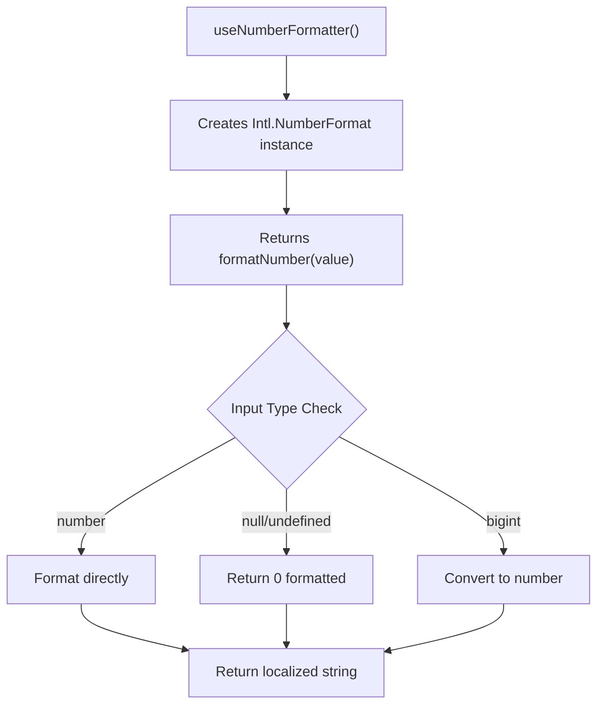
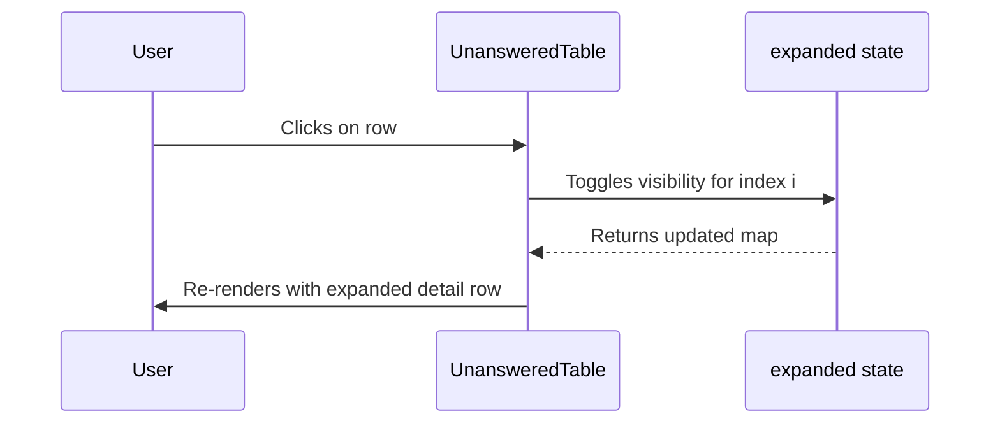

# Data Tables

<cite>
**Referenced Files in This Document**   
- [TopLinksTable.tsx](file://app/components/tables/TopLinksTable.tsx)
- [TopWordsTable.tsx](file://app/components/tables/TopWordsTable.tsx)
- [TopThreadsTable.tsx](file://app/components/tables/TopThreadsTable.tsx)
- [UnansweredTable.tsx](file://app/components/tables/UnansweredTable.tsx)
- [TopErrorsTable.tsx](file://app/components/tables/TopErrorsTable.tsx)
- [TopHelpersTable.tsx](file://app/components/tables/TopHelpersTable.tsx)
- [ArtifactsTable.tsx](file://app/components/tables/ArtifactsTable.tsx)
- [HashtagsTable.tsx](file://app/components/tables/HashtagsTable.tsx)
- [MentionsTable.tsx](file://app/components/tables/MentionsTable.tsx)
- [ForwardedFromTable.tsx](file://app/components/tables/ForwardedFromTable.tsx)
- [DashboardShell.tsx](file://app/components/DashboardShell.tsx)
- [useNumberFormatter.ts](file://app/hooks/useNumberFormatter.ts)
- [schema.ts](file://lib/report/schema.ts)
</cite>

## Table of Contents
1. [Introduction](#introduction)
2. [Core Design Pattern](#core-design-pattern)
3. [Shared Dependencies and Utilities](#shared-dependencies-and-utilities)
4. [Individual Table Analysis](#individual-table-analysis)
5. [Integration with Dashboard Layout](#integration-with-dashboard-layout)
6. [Potential Extensions](#potential-extensions)

## Introduction

The `tg-vibecoders-dashboard` features a suite of data tables designed to present ranked entities and specialized analysis results from Telegram chat activity. These components—`TopLinksTable`, `TopWordsTable`, `TopThreadsTable`, `UnansweredTable`, `TopErrorsTable`, `TopHelpersTable`, `ArtifactsTable`, `HashtagsTable`, `MentionsTable`, and `ForwardedFromTable`—serve as the primary interface for displaying sorted, metric-driven insights. Each table follows a consistent design philosophy centered around clarity, responsiveness, and integration within a larger dashboard framework.

These tables are not standalone visualizations but are tightly coupled with backend-generated data structures defined in the report schema. They receive pre-sorted row data via props from the central `ApiData` object managed by `DashboardShell`, ensuring that sorting logic is handled server-side. The uniformity across these components enables maintainability while allowing for domain-specific adaptations in column structure and interaction patterns.

## Core Design Pattern

All ten tables adhere to a shared architectural pattern that emphasizes simplicity, reusability, and performance:

- **Props-Based Data Ingestion**: Each table accepts a `rows` prop (typically optional with a default empty array) containing structured data objects. This data is passed down from `DashboardShell`, which fetches it via API calls.
- **Empty State Handling**: If the `rows` array is empty or undefined, the component returns `null`, gracefully disappearing from the UI rather than rendering an empty container.
- **Client-Side Formatting**: Numeric values such as counts and durations are formatted using the `useNumberFormatter` hook, which leverages `Intl.NumberFormat` for locale-aware presentation (defaulting to `ru-RU`).
- **Styling Consistency**: All tables are wrapped in a `<section>` element with the `panel` class and constrained height (`max-h-*`) to ensure scrollable overflow behavior within fixed dashboard regions.
- **Header Labeling**: Each table displays a descriptive header in uppercase text, styled consistently with `text-xs uppercase font-bold text-gray-500 tracking-wider`.

This pattern ensures that each table functions predictably and integrates seamlessly into the broader layout without duplicating core logic.

**Section sources**
- [TopLinksTable.tsx](file://app/components/tables/TopLinksTable.tsx#L8-L29)
- [TopWordsTable.tsx](file://app/components/tables/TopWordsTable.tsx#L6-L22)
- [TopThreadsTable.tsx](file://app/components/tables/TopThreadsTable.tsx#L6-L22)
- [UnansweredTable.tsx](file://app/components/tables/UnansweredTable.tsx#L8-L32)
- [TopErrorsTable.tsx](file://app/components/tables/TopErrorsTable.tsx#L7-L23)
- [TopHelpersTable.tsx](file://app/components/tables/TopHelpersTable.tsx#L6-L22)
- [ArtifactsTable.tsx](file://app/components/tables/ArtifactsTable.tsx#L5-L20)
- [HashtagsTable.tsx](file://app/components/tables/HashtagsTable.tsx#L7-L23)
- [MentionsTable.tsx](file://app/components/tables/MentionsTable.tsx#L7-L23)
- [ForwardedFromTable.tsx](file://app/components/tables/ForwardedFromTable.tsx#L7-L37)

## Shared Dependencies and Utilities

### useNumberFormatter Hook

The `useNumberFormatter` hook is a critical dependency used by most tables to format numeric metrics like message counts, reply frequencies, and time durations. It abstracts away locale-specific number formatting, returning a `formatNumber` function that safely handles `null`, `undefined`, and `bigint` inputs.

**Diagram sources**
- [useNumberFormatter.ts](file://app/hooks/useNumberFormatter.ts#L2-L9)

**Section sources**
- [useNumberFormatter.ts](file://app/hooks/useNumberFormatter.ts#L2-L9)

### TypeScript Interfaces and Row Structures

Each table defines its own props interface, typically named `{TableName}Props`, specifying the shape of the expected `rows` array. Notably, several tables share a common `Row` type definition locally within their files, indicating similar data shapes:

- `HashtagsTable`, `MentionsTable`, `TopErrorsTable`: `{ token: string; cnt: number }`
- `UnansweredTable`: `{ id: string | number; preview: string; hours: number; text?: string }`
- `ArtifactsTable`: `{ id: string | number; url?: string; hasCode?: boolean; preview?: string }`
- `ForwardedFromTable`: `{ url?: string; title?: string; chat_id: string | number; username?: string; cnt: number }`

These interfaces align closely with Zod schemas defined in `lib/report/schema.ts`, particularly `PreviewSchema` and `LlmJsonSchema`, confirming that data validation occurs on the server before reaching the client.

**Section sources**
- [TopLinksTable.tsx](file://app/components/tables/TopLinksTable.tsx#L4-L6)
- [TopWordsTable.tsx](file://app/components/tables/TopWordsTable.tsx#L4-L4)
- [TopThreadsTable.tsx](file://app/components/tables/TopThreadsTable.tsx#L4-L4)
- [UnansweredTable.tsx](file://app/components/tables/UnansweredTable.tsx#L5-L5)
- [TopErrorsTable.tsx](file://app/components/tables/TopErrorsTable.tsx#L4-L4)
- [TopHelpersTable.tsx](file://app/components/tables/TopHelpersTable.tsx#L4-L4)
- [ArtifactsTable.tsx](file://app/components/tables/ArtifactsTable.tsx#L2-L2)
- [HashtagsTable.tsx](file://app/components/tables/HashtagsTable.tsx#L4-L4)
- [MentionsTable.tsx](file://app/components/tables/MentionsTable.tsx#L4-L4)
- [ForwardedFromTable.tsx](file://app/components/tables/ForwardedFromTable.tsx#L4-L4)
- [schema.ts](file://lib/report/schema.ts#L1-L57)

## Individual Table Analysis

### TopLinksTable, TopWordsTable, HashtagsTable, MentionsTable, TopErrorsTable, TopHelpersTable

These six tables follow the simplest pattern: they render a two-column table listing an entity (e.g., URL, word, hashtag) alongside its frequency count. All utilize `formatNumber` for the count column and support direct linking where applicable (e.g., URLs in `TopLinksTable`). Their headers reflect their purpose with clear, localized labels.

They assume server-side sorting and display only the top N entries without pagination or client-side filtering.

**Section sources**
- [TopLinksTable.tsx](file://app/components/tables/TopLinksTable.tsx#L8-L29)
- [TopWordsTable.tsx](file://app/components/tables/TopWordsTable.tsx#L6-L22)
- [HashtagsTable.tsx](file://app/components/tables/HashtagsTable.tsx#L7-L23)
- [MentionsTable.tsx](file://app/components/tables/MentionsTable.tsx#L7-L23)
- [TopErrorsTable.tsx](file://app/components/tables/TopErrorsTable.tsx#L7-L23)
- [TopHelpersTable.tsx](file://app/components/tables/TopHelpersTable.tsx#L6-L22)

### TopThreadsTable

This table presents threads with the highest number of replies, showing the root message ID, reply count, and a textual preview. It spans two columns in the grid layout (`lg:col-span-2`) due to its importance and content width. Like others, it relies on pre-sorted data and does not offer interactive sorting.

**Section sources**
- [TopThreadsTable.tsx](file://app/components/tables/TopThreadsTable.tsx#L6-L22)

### ArtifactsTable

Displays messages identified as "ship-it" artifacts or code snippets. It conditionally renders either a link (if `url` exists) or a placeholder ("code snippet") based on metadata. The preview provides context, and the table supports both artifact IDs and embedded content indicators.

**Section sources**
- [ArtifactsTable.tsx](file://app/components/tables/ArtifactsTable.tsx#L5-L20)

### ForwardedFromTable

Unique in handling potentially missing data, this table displays channels from which messages were forwarded into the current chat. It intelligently formats channel names using available fields (`title`, `username`, or `chat_id`) and includes hyperlinks when URLs are provided. It also renders a fallback message when no forwarding data is present.

It occupies three columns (`lg:col-span-3`) in the layout, reflecting its expansive nature.

**Section sources**
- [ForwardedFromTable.tsx](file://app/components/tables/ForwardedFromTable.tsx#L7-L37)

### UnansweredTable

The most interactive table, `UnansweredTable` allows users to click on a row to expand and view the full message text. This is achieved through a local `expanded` state object that tracks visibility per index. The expansion row uses `colSpan={3}` and applies `whitespace-pre-wrap` to preserve formatting.

This demonstrates a deviation from purely static presentation, introducing user-driven detail disclosure.

**Diagram sources**
- [UnansweredTable.tsx](file://app/components/tables/UnansweredTable.tsx#L8-L32)

**Section sources**
- [UnansweredTable.tsx](file://app/components/tables/UnansweredTable.tsx#L8-L32)

## Integration with Dashboard Layout

All tables are orchestrated within `DashboardShell`, which manages data fetching, filtering (via `ChatSelect` and `WindowSelect`), and conditional rendering. The layout uses a responsive grid system:

- A base `grid-cols-1` layout stacks all components vertically