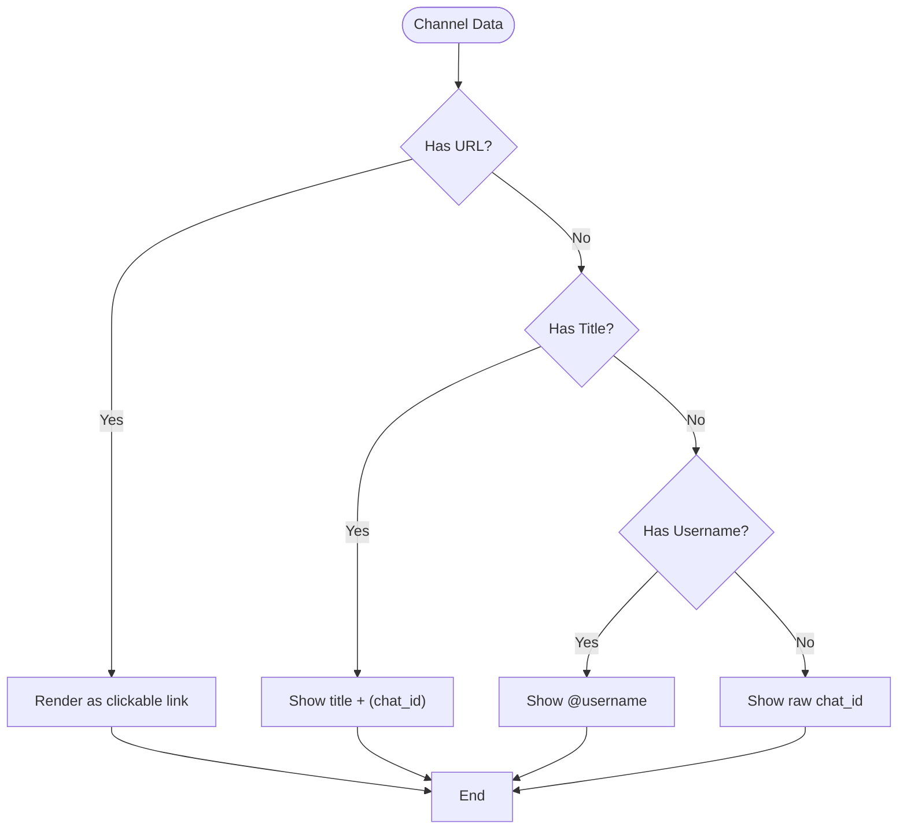
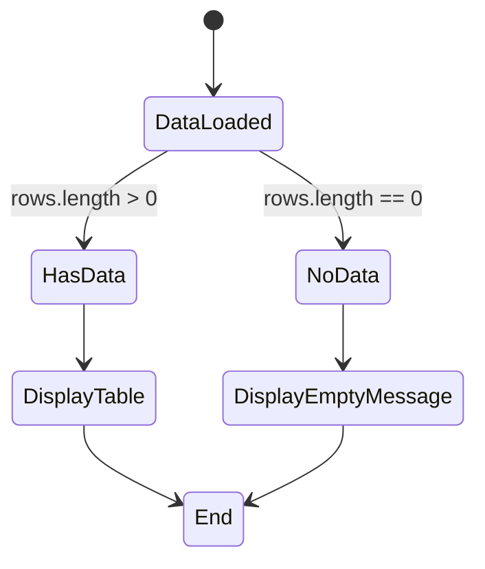
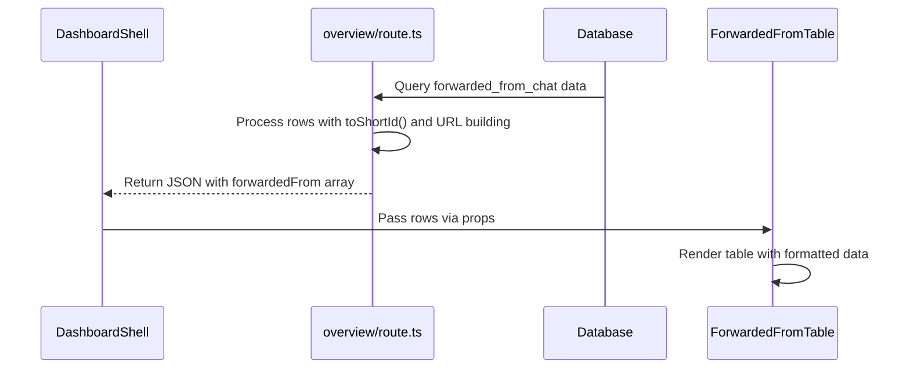
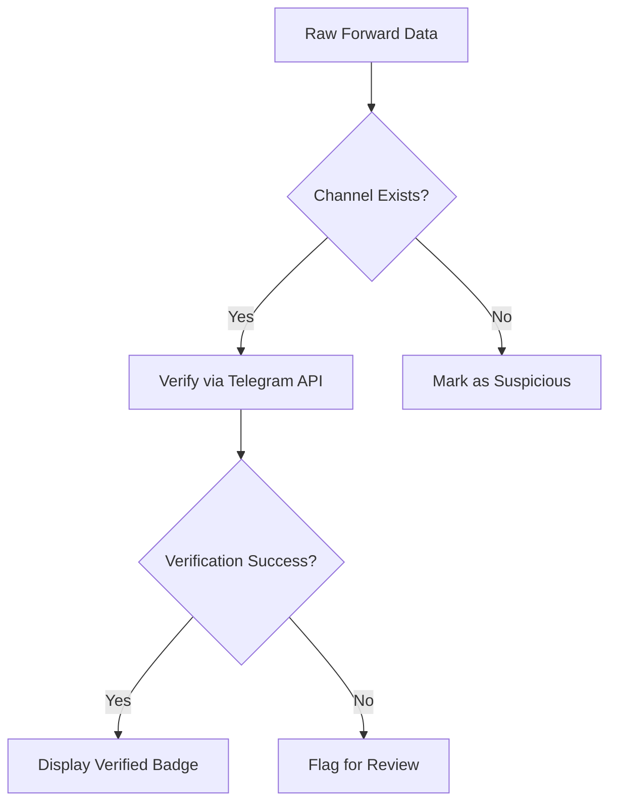

# Forwarded From Table

<cite>
**Referenced Files in This Document**   
- [ForwardedFromTable.tsx](file://app/components/tables/ForwardedFromTable.tsx)
- [overview/route.ts](file://app/api/overview/route.ts)
- [DashboardShell.tsx](file://app/components/DashboardShell.tsx)
</cite>

## Table of Contents
1. [Introduction](#introduction)
2. [Component Overview](#component-overview)
3. [Props Structure and Data Schema](#props-structure-and-data-schema)
4. [Rendering Logic and Channel Identification](#rendering-logic-and-channel-identification)
5. [Layout and Styling](#layout-and-styling)
6. [Empty State Handling](#empty-state-handling)
7. [Data Flow and Integration](#data-flow-and-integration)
8. [Example Usage with Mixed Channel Types](#example-usage-with-mixed-channel-types)
9. [Data Accuracy Challenges and Improvement Opportunities](#data-accuracy-challenges-and-improvement-opportunities)
10. [Conclusion](#conclusion)

## Introduction

The ForwardedFromTable component plays a critical role in analyzing content sourcing within Telegram chat analytics. It identifies external channels that contribute content to the analyzed chat through message forwarding, providing insights into external influence and information flow patterns. This documentation details the component's implementation, data handling, rendering logic, and integration within the dashboard system.

**Section sources**
- [ForwardedFromTable.tsx](file://app/components/tables/ForwardedFromTable.tsx#L7-L37)

## Component Overview

The ForwardedFromTable is a React client component designed to display statistics about messages forwarded from external Telegram channels into the currently analyzed chat. It serves as a key analytical tool for understanding the external sources that influence conversation dynamics within a specific chat environment.

The component renders a table showing the top channels by volume of forwarded messages, including channel identification information such as titles, usernames, and direct links when available. Each entry displays the channel identifier and the count of messages forwarded from that source, allowing users to quickly identify the most influential external content providers.

**Section sources**
- [ForwardedFromTable.tsx](file://app/components/tables/ForwardedFromTable.tsx#L7-L37)

## Props Structure and Data Schema

The component accepts a single prop `rows` which is an array of objects containing forwarded channel data. The Row interface defines the expected structure:

```typescript
type Row = { 
  url?: string; 
  title?: string; 
  chat_id: string | number; 
  username?: string; 
  cnt: number 
};
```

Each row contains:
- **url**: Optional direct link to the source channel or specific message
- **title**: Optional human-readable name of the channel
- **chat_id**: Unique identifier of the source channel (required)
- **username**: Optional Telegram @username handle
- **cnt**: Count of messages forwarded from this channel

The component initializes with an empty array default (`rows = []`) to handle cases where no forwarded messages exist in the analyzed time window.

**Section sources**
- [ForwardedFromTable.tsx](file://app/components/tables/ForwardedFromTable.tsx#L4-L5)

## Rendering Logic and Channel Identification

The component implements sophisticated rendering logic to present channel information in the most informative way possible, handling multiple identification methods based on available data.



**Diagram sources**
- [ForwardedFromTable.tsx](file://app/components/tables/ForwardedFromTable.tsx#L15-L27)

The rendering hierarchy prioritizes user-friendly identifiers:
1. When a URL is available, the channel is rendered as a clickable hyperlink
2. If a title exists, it displays as "Title (chat_id)" format
3. If only a username is available, it shows as "@username"
4. As fallback, the raw chat_id is displayed

This cascading approach ensures maximum usability while accommodating incomplete data from the Telegram API.

**Section sources**
- [ForwardedFromTable.tsx](file://app/components/tables/ForwardedFromTable.tsx#L15-L27)

## Layout and Styling

The component utilizes a responsive grid layout with specific width allocation to emphasize its importance in the analytics dashboard. The CSS class `lg:col-span-3` indicates that the component spans three columns in the large-screen grid layout, making it one of the widest components on the page.

This wide layout accommodates the potentially long channel identifiers and URLs while maintaining readability. The component is wrapped in a "panel" container with overflow-auto scrolling for cases where numerous channels are listed. Additional spacing (space-y-2) provides visual separation from adjacent components.

The header uses a distinct styling with uppercase text, bold font weight, gray color, and tracking-wider letter spacing to create a clear section divider that matches the dashboard's design language.

**Section sources**
- [ForwardedFromTable.tsx](file://app/components/tables/ForwardedFromTable.tsx#L9-L11)

## Empty State Handling

The component includes specialized empty state messaging that addresses the scenario when no forwarded messages are detected in the selected time window. Instead of generic messaging, it displays a Russian-language message: "Нет пересылок в выбранном чате за окно" which translates to "No forwards in the selected chat for the window."



**Diagram sources**
- [ForwardedFromTable.tsx](file://app/components/tables/ForwardedFromTable.tsx#L28-L30)

This targeted messaging provides immediate feedback to users about the absence of forwarded content, helping them understand that the lack of data is a meaningful analytical result rather than a system error. The use of Russian suggests the primary user base for this dashboard is Russian-speaking.

**Section sources**
- [ForwardedFromTable.tsx](file://app/components/tables/ForwardedFromTable.tsx#L28-L30)

## Data Flow and Integration

The ForwardedFromTable integrates with the broader analytics system through a well-defined data pipeline that begins with database queries and ends with UI rendering.



**Diagram sources**
- [overview/route.ts](file://app/api/overview/route.ts#L294-L329)
- [DashboardShell.tsx](file://app/components/DashboardShell.tsx#L96)
- [ForwardedFromTable.tsx](file://app/components/tables/ForwardedFromTable.tsx#L7)

The data originates from PostgreSQL queries that extract forwarded message metadata from the messages table, specifically targeting the `forward_from_chat` field in Telegram's message payload. The API endpoint processes this raw data by:
- Converting internal chat IDs to Telegram's short ID format
- Constructing navigable URLs using usernames or short IDs
- Building sample message links when message IDs are available
- Formatting the response according to the component's expected schema

The DashboardShell component receives this processed data and passes it directly to ForwardedFromTable via props, maintaining a clean separation of concerns.

**Section sources**
- [overview/route.ts](file://app/api/overview/route.ts#L294-L329)
- [DashboardShell.tsx](file://app/components/DashboardShell.tsx#L96)
- [ForwardedFromTable.tsx](file://app/components/tables/ForwardedFromTable.tsx#L7)

## Example Usage with Mixed Channel Types

Consider a scenario where the analyzed chat contains forwarded messages from various channel types:

1. **Official Channel with Username**: A channel titled "Tech News Daily" with username @technews and chat_id -1001234567890
   - Renders as: [Tech News Daily (-1001234567890)](https://t.me/technews) with 152 forwards

2. **Private Group without Username**: A group titled "Developer Discussion" with chat_id -456789 and no public username
   - Renders as: Developer Discussion (-456789) with 89 forwards

3. **Anonymous Channel**: A channel with no title, no username, but chat_id -1009876543210
   - Renders as: -1009876543210 with 43 forwards

4. **User-to-User Forward**: A message forwarded directly from another user with username @alex_dev
   - Renders as: [@alex_dev](https://t.me/alex_dev) with 28 forwards

This mixed example demonstrates how the component gracefully handles different levels of channel identification information, providing the most usable representation possible for each case while maintaining consistent formatting across the table.

**Section sources**
- [ForwardedFromTable.tsx](file://app/components/tables/ForwardedFromTable.tsx#L15-L27)
- [overview/route.ts](file://app/api/overview/route.ts#L331-L352)

## Data Accuracy Challenges and Improvement Opportunities

While the ForwardedFromTable provides valuable insights, several data accuracy challenges exist that could be addressed through improvements:

### Current Limitations
1. **Incomplete Attribution**: Telegram's API may not always provide complete forwarding metadata, especially for messages forwarded through multiple intermediaries
2. **ID Mapping Issues**: Raw chat IDs require conversion to short IDs for URL construction, creating potential mapping errors
3. **Temporal Resolution**: The current implementation shows aggregate counts without temporal distribution of forwarding activity

### Suggested Improvements

#### Source Verification System


Implementing source verification would enhance data reliability by confirming that identified channels actually exist and match the provided metadata.

#### Forward Velocity Metrics
Introducing metrics that track the speed at which content propagates from source channels to the target chat could reveal influential early adopters and trending topics. This might include:
- Time-to-forward calculations
- Exponential growth rate of forwarded content
- Network centrality measures for source channels

#### Enhanced Attribution Model
A more sophisticated attribution model could address multi-hop forwarding by:
- Tracking forwarding chains beyond direct sources
- Weighting influence based on proximity in the forwarding chain
- Distinguishing between original sources and intermediate re-sharers

These improvements would transform the component from a simple counter to a comprehensive influence analysis tool, providing deeper insights into content dissemination patterns within the Telegram ecosystem.

**Section sources**
- [overview/route.ts](file://app/api/overview/route.ts#L294-L329)
- [ForwardedFromTable.tsx](file://app/components/tables/ForwardedFromTable.tsx#L7-L37)

## Conclusion

The ForwardedFromTable component serves as a vital analytical instrument for understanding external content influence within Telegram chats. By identifying and quantifying message sources from other channels, it reveals the information ecosystems that feed into specific conversations. Its thoughtful rendering logic accommodates varying levels of channel identification data, while its integration with the backend analytics pipeline ensures timely and relevant insights.

The component's wide layout reflects its importance in the overall dashboard, giving prominence to external influence metrics. However, opportunities exist to enhance its capabilities through source verification, forward velocity analysis, and more sophisticated attribution modeling. These improvements would address current data accuracy challenges and provide even deeper insights into content propagation patterns across the Telegram platform.