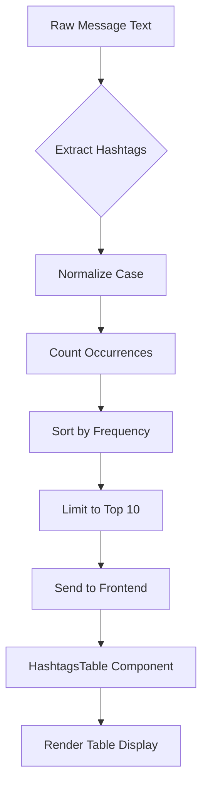
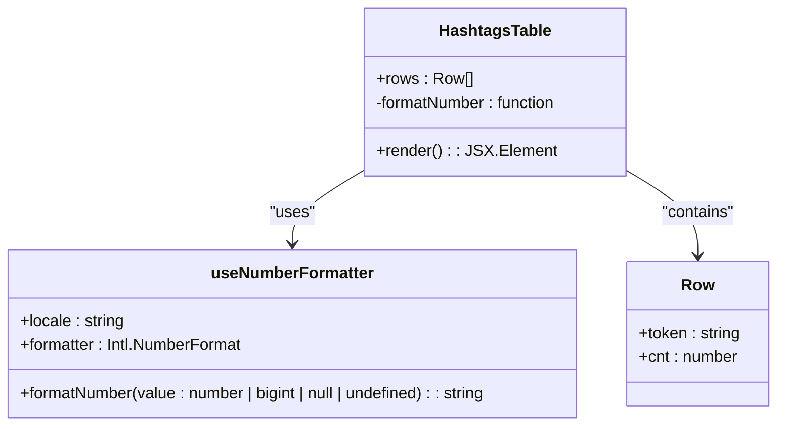

# Hashtags Table

<cite>
**Referenced Files in This Document**   
- [HashtagsTable.tsx](file://app/components/tables/HashtagsTable.tsx)
- [useNumberFormatter.ts](file://app/hooks/useNumberFormatter.ts)
- [DashboardShell.tsx](file://app/components/DashboardShell.tsx)
- [route.ts](file://app/api/overview/route.ts)
</cite>

## Table of Contents
1. [Introduction](#introduction)
2. [Core Functionality](#core-functionality)
3. [Component Structure and Props](#component-structure-and-props)
4. [Data Formatting and Number Presentation](#data-formatting-and-number-presentation)
5. [Visual Design and Styling](#visual-design-and-styling)
6. [Integration and Usage Context](#integration-and-usage-context)
7. [Hashtag Processing and Normalization](#hashtag-processing-and-normalization)
8. [Usage Example with Popular Hashtags](#usage-example-with-popular-hashtags)
9. [Current Limitations and Challenges](#current-limitations-and-challenges)
10. [Suggested Improvements](#suggested-improvements)

## Introduction

The HashtagsTable component is a specialized UI element designed to visualize the frequency of hashtag usage within a messaging platform or social media analytics dashboard. It serves as a critical tool for identifying trending topics, measuring campaign effectiveness, and understanding community interests by presenting the most frequently used hashtags in descending order of occurrence. The component transforms raw message data into actionable insights by highlighting which topics are gaining traction among users.

**Section sources**
- [HashtagsTable.tsx](file://app/components/tables/HashtagsTable.tsx#L7-L23)

## Core Functionality

HashtagsTable analyzes message content to extract and count hashtag occurrences, revealing patterns in user engagement and topic popularity. By displaying hashtags alongside their frequency counts, it enables users to quickly identify emerging trends and gauge the relative popularity of different subjects within the analyzed dataset. This functionality supports strategic decision-making for content creators, community managers, and marketing teams who need to understand what topics resonate with their audience.

The component processes hashtag data that has already been aggregated by the backend system, focusing solely on presentation rather than data extraction or computation. It receives pre-processed data containing hashtag tokens and their corresponding counts, then renders this information in a clean, tabular format optimized for quick scanning and comparison.



**Diagram sources**
- [route.ts](file://app/api/overview/route.ts#L280-L292)

## Component Structure and Props

The HashtagsTable component accepts a single optional prop: `rows`, which is an array of objects containing hashtag data. Each object in the array must have two properties:
- `token`: string representing the hashtag (including the # symbol)
- `cnt`: number representing the occurrence count of that hashtag

When no rows are provided or the array is empty, the component returns null, effectively hiding itself from the interface. This conditional rendering ensures that the UI remains clean when there is no relevant data to display.

The component follows React best practices with proper typing through TypeScript interfaces, ensuring type safety and clear documentation of expected data structures. It uses functional components with hooks, specifically leveraging the `useNumberFormatter` hook for consistent number formatting across the application.

**Section sources**
- [HashtagsTable.tsx](file://app/components/tables/HashtagsTable.tsx#L4-L6)

## Data Formatting and Number Presentation

All numerical values in HashtagsTable are formatted using the `formatNumber` utility function imported from the `useNumberFormatter` hook. This ensures consistent presentation of numbers throughout the application according to locale-specific formatting rules. The formatter handles various edge cases including null, undefined, and bigint values, converting them to properly formatted strings for display.

The use of a centralized number formatting system provides several benefits:
- Consistent visual appearance of numbers across all components
- Automatic handling of internationalization (currently set to ru-RU locale)
- Proper formatting of large numbers with appropriate separators
- Robust error handling for unexpected input types

This approach maintains uniformity in data presentation and reduces the risk of formatting inconsistencies that could confuse users interpreting the analytics data.



**Diagram sources**
- [HashtagsTable.tsx](file://app/components/tables/HashtagsTable.tsx#L7-L23)
- [useNumberFormatter.ts](file://app/hooks/useNumberFormatter.ts#L4-L7)

## Visual Design and Styling

HashtagsTable employs a minimalist design approach with a focus on readability and efficient use of space. The component is wrapped in a panel container with overflow scrolling enabled, limiting its maximum height to 64 units while allowing vertical scrolling when content exceeds this limit. This prevents the table from dominating the interface while still providing access to all data.

The table features a header with column titles "#Хэштег" (Hashtag) and "Кол-во" (Count), styled with uppercase text, bold font weight, gray color, and increased letter spacing for emphasis. The body displays hashtag tokens in plain text and their counts using the formatted number display. Rows are separated by implicit table styling, and the entire component maintains consistent spacing with other elements through the use of Tailwind CSS utility classes.

This design prioritizes clarity and scannability, allowing users to quickly identify the most popular hashtags without visual distractions.

**Section sources**
- [HashtagsTable.tsx](file://app/components/tables/HashtagsTable.tsx#L10-L22)

## Integration and Usage Context

HashtagsTable is integrated into the main dashboard layout through the DashboardShell component, where it appears alongside other analytical tables in a responsive grid system. It occupies one cell in a five-column layout on large screens, demonstrating its equal importance among other key metrics such as top links, words, mentions, and threads.

The component receives its data from the API endpoint at `/api/overview`, which aggregates message content across specified time periods and chat filters. When the dashboard loads or when filters change, the API processes recent messages, extracts hashtags, counts their occurrences, and returns the top 10 results to be displayed in HashtagsTable.

This integration pattern follows a clear separation of concerns, with data processing handled by the backend API and presentation managed by the frontend component, enabling efficient updates and maintainable code organization.

```mermaid
graph TB
subgraph "Frontend"
DS[DashboardShell]
HT[HashtagsTable]
UI[User Interface]
end
subgraph "Backend"
API[/api/overview]
DB[(Database)]
end
UI --> DS
DS --> HT
DS --> API
API --> DB
DB --> API
API --> DS
DS --> HT
style HT fill:#f9f,stroke:#333
```

**Diagram sources**
- [DashboardShell.tsx](file://app/components/DashboardShell.tsx#L88-L92)
- [route.ts](file://app/api/overview/route.ts#L280-L292)

## Hashtag Processing and Normalization

The system implements basic normalization by converting all hashtags to lowercase during the counting process, which addresses case sensitivity issues that could otherwise fragment the same hashtag into multiple entries (e.g., #React, #react, and #REACT would be counted separately without normalization). This ensures that variations in capitalization do not affect the accuracy of frequency counts.

The hashtag extraction uses a regular expression pattern `/#[A-Za-zА-Яа-я0-9_]+/g` that captures hashtags containing Latin and Cyrillic characters, digits, and underscores. This supports multilingual content commonly found in international communities. After extraction, each hashtag is converted to lowercase before being added to the counting map, ensuring that case variants are treated as the same entity.

However, the current implementation does not address other potential normalization issues such as Unicode normalization (handling accented characters), synonym recognition, or stemming variations.

**Section sources**
- [route.ts](file://app/api/overview/route.ts#L283-L286)

## Usage Example with Popular Hashtags

In a typical usage scenario, HashtagsTable might display data like:

| #Хэштег | Кол-во |
|--------|--------|
| #news | 1,247 |
| #technology | 983 |
| #programming | 856 |
| #javascript | 742 |
| #AI | 689 |
| #webdev | 573 |
| #startup | 498 |
| #design | 432 |
| #marketing | 387 |
| #productivity | 321 |

This example illustrates how the component helps identify dominant topics within a community. The clear ranking by frequency allows stakeholders to immediately see which subjects generate the most discussion. For instance, if a company runs a marketing campaign with a specific hashtag, they can monitor its position in this table over time to assess campaign effectiveness and adjust strategies accordingly.

The component's ability to highlight emerging topics makes it valuable for real-time community management, enabling moderators and administrators to respond promptly to trending discussions.

## Current Limitations and Challenges

Despite its effective core functionality, HashtagsTable faces several limitations in hashtag analysis:

1. **Case Sensitivity Handling**: While lowercase conversion addresses basic case variations, it doesn't handle more complex Unicode normalization issues that might affect non-Latin scripts.

2. **Synonym Recognition**: The system treats similar hashtags as distinct entities (e.g., #machinelearning vs #ml vs #artificialintelligence), missing opportunities to group related topics.

3. **Contextual Understanding**: Hashtags are analyzed purely by frequency without considering semantic relationships or contextual meaning, potentially overlooking nuanced topic connections.

4. **Temporal Analysis**: The current implementation provides only static frequency counts without trend visualization over time, limiting insights into how topics evolve.

5. **Hashtag Variants**: Common variations like plural/singular forms (#developer vs #developers) or abbreviations are treated as separate entities rather than related concepts.

These limitations restrict the depth of insights that can be derived from the hashtag data, particularly for sophisticated community analysis or strategic planning purposes.

**Section sources**
- [route.ts](file://app/api/overview/route.ts#L280-L292)

## Suggested Improvements

To enhance the analytical capabilities of the HashtagsTable component, several improvements could be implemented:

### Topic Clustering Implementation
Introduce natural language processing techniques to group semantically similar hashtags into broader topics. For example:
- Cluster #react, #vue, #angular under "Frontend Frameworks"
- Group #python, #javascript, #rust under "Programming Languages"
- Combine #ai, #machinelearning, #deeplearning into "Artificial Intelligence"

This would provide higher-level insights beyond individual hashtag frequencies, revealing thematic trends within the community.

### Popularity Trend Visualization
Enhance the component to show temporal trends by integrating with the hourly and daily chart components. Possible approaches include:
- Adding sparklines next to each hashtag showing recent activity patterns
- Implementing a toggle between "Top All Time" and "Trending Now" views
- Including percentage change indicators compared to previous periods

### Advanced Normalization
Improve hashtag processing with:
- Unicode normalization to handle accented characters consistently
- Stemming algorithms to group word variations (e.g., #coding, #coder, #code)
- Synonym mapping through configurable dictionaries
- Regular expression patterns to handle common abbreviation patterns

### Interactive Features
Add user interaction capabilities such as:
- Clickable hashtags that filter the dashboard to show related content
- Tooltip hover effects displaying additional context or sample messages
- Sorting controls to switch between different metrics (alphabetical, growth rate)

### Enhanced Visualization
Consider alternative or supplementary visualizations:
- Tag cloud representation alongside the table view
- Network graph showing relationships between frequently co-occurring hashtags
- Heatmap showing hashtag usage patterns across different times of day

These improvements would transform HashtagsTable from a simple frequency counter into a comprehensive trend analysis tool, providing deeper insights into community behavior and content dynamics.