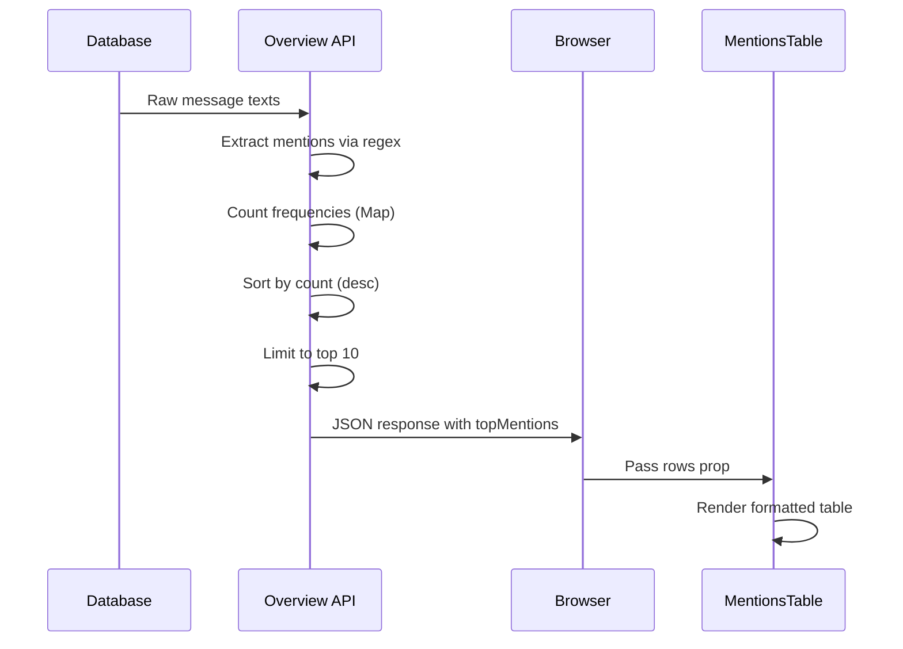
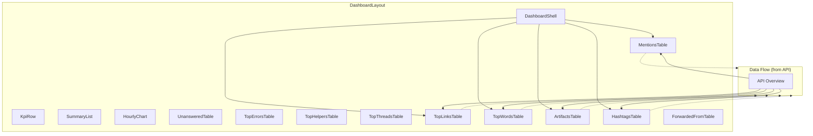

# Mentions Table

<cite>
**Referenced Files in This Document**  
- [MentionsTable.tsx](file://app/components/tables/MentionsTable.tsx)
- [useNumberFormatter.ts](file://app/hooks/useNumberFormatter.ts)
- [HashtagsTable.tsx](file://app/components/tables/HashtagsTable.tsx)
- [DashboardShell.tsx](file://app/components/DashboardShell.tsx)
- [route.ts](file://app/api/overview/route.ts)
</cite>

## Table of Contents
1. [Introduction](#introduction)
2. [Component Purpose and Functionality](#component-purpose-and-functionality)
3. [Props Interface Definition](#props-interface-definition)
4. [Visual Design and Consistency](#visual-design-and-consistency)
5. [Data Processing Pipeline](#data-processing-pipeline)
6. [Usage Context and Integration](#usage-context-and-integration)
7. [Analytical Value of Mention Data](#analytical-value-of-mention-data)
8. [Practical Example with Sample Data](#practical-example-with-sample-data)
9. [Privacy Implications](#privacy-implications)
10. [Enhancement Opportunities](#enhancement-opportunities)

## Introduction

The MentionsTable component is a specialized UI element within the Telegram community analytics dashboard that visualizes user mention patterns across messages. It serves as a key tool for identifying influential members, tracking communication dynamics, and understanding social networks within chat communities. By analyzing @user mentions, this component reveals how information flows and who drives conversations.

**Section sources**
- [MentionsTable.tsx](file://app/components/tables/MentionsTable.tsx#L7-L23)

## Component Purpose and Functionality

The MentionsTable component displays the most frequently mentioned users in a ranked table format, showing both the mention handle (e.g., @username) and its frequency count. Its primary purpose is to identify key participants in discussions by quantifying how often they are referenced by others. This metric helps surface influential community members who may not be the most active posters but are frequently cited or addressed by peers.

When no mention data is available, the component gracefully renders nothing, maintaining clean UI presentation without empty states. The component processes incoming mention data and presents it in descending order of frequency, allowing immediate identification of top-mentioned individuals.

```mermaid
flowchart TD
A[Raw Message Text] --> B{Extract Mentions}
B --> C[/Regex: @[A-Za-zA-Яа-я0-9_]+/]
C --> D[Mention Tokens]
D --> E[Count Frequencies]
E --> F[Sort by Count Descending]
F --> G[Limited to Top 10]
G --> H[MentionsTable Component]
H --> I[Rendered UI Table]
```

**Diagram sources**  
- [route.ts](file://app/api/overview/route.ts#L287-L289)
- [MentionsTable.tsx](file://app/components/tables/MentionsTable.tsx#L7-L23)

**Section sources**
- [MentionsTable.tsx](file://app/components/tables/MentionsTable.tsx#L7-L23)
- [route.ts](file://app/api/overview/route.ts#L280-L289)

## Props Interface Definition

The component accepts a single optional prop `rows` which follows the `MentionsTableProps` interface. Each row contains two properties:
- `token`: string representing the mention handle (including @ symbol)
- `cnt`: number representing the frequency count of that mention

The rows are typed as an array of objects with these properties, defaulting to an empty array when no data is provided. This design ensures the component can handle missing or incomplete data without rendering errors.

```typescript
type Row = { token: string; cnt: number };
type MentionsTableProps = { rows?: Row[] };
```

**Section sources**
- [MentionsTable.tsx](file://app/components/tables/MentionsTable.tsx#L5-L7)

## Visual Design and Consistency

The MentionsTable maintains visual consistency with other ranking tables in the dashboard through shared styling patterns and layout principles. It uses the same panel container class with overflow handling and maximum height constraints, ensuring uniform scrolling behavior across similar components.

The table header displays "Упоминания" (Russian for "Mentions") in uppercase with bold font and tracking wider letter spacing, matching the typographic treatment of other section headers. Column headers use "@Упоминание" (@"Mention") and "Кол-во" ("Quantity"), maintaining Russian localization consistent with the overall application language.

Number formatting is handled consistently using the shared `useNumberFormatter` hook, which applies locale-specific number formatting (ru-RU by default). This ensures all numerical values across the dashboard follow the same formatting rules, including thousand separators and decimal precision.

```mermaid
classDiagram
class MentionsTable {
+rows : Array<{token : string, cnt : number}>
-formatNumber : function
+render() : JSX.Element
}
class HashtagsTable {
+rows : Array<{token : string, cnt : number}>
-formatNumber : function
+render() : JSX.Element
}
class NumberFormatter {
+locale : string
+formatNumber(value : number) : string
}
MentionsTable --> NumberFormatter : "uses"
HashtagsTable --> NumberFormatter : "uses"
MentionsTable ..|> RankingTableInterface : "implements"
HashtagsTable ..|> RankingTableInterface : "implements"
```

**Diagram sources**  
- [MentionsTable.tsx](file://app/components/tables/MentionsTable.tsx#L7-L23)
- [useNumberFormatter.ts](file://app/hooks/useNumberFormatter.ts#L4-L8)
- [HashtagsTable.tsx](file://app/components/tables/HashtagsTable.tsx#L7-L23)

**Section sources**
- [MentionsTable.tsx](file://app/components/tables/MentionsTable.tsx#L7-L23)
- [useNumberFormatter.ts](file://app/hooks/useNumberFormatter.ts#L4-L8)
- [HashtagsTable.tsx](file://app/components/tables/HashtagsTable.tsx#L7-L23)

## Data Processing Pipeline

Mention data originates from raw message text extraction in the API layer, where regular expressions identify all @mentions. The processing pipeline normalizes mention tokens to lowercase to prevent duplicates from case variations, counts frequencies using Map structures, sorts results by count in descending order, and limits output to the top 10 most mentioned users.

This processing occurs server-side in the `/api/overview` route, ensuring efficient data transformation before transmission to the client. The regex pattern `/@[A-Za-zA-Яа-я0-9_]+/g` captures mentions containing Latin and Cyrillic characters, digits, and underscores, accommodating international username conventions.



**Diagram sources**  
- [route.ts](file://app/api/overview/route.ts#L280-L289)
- [MentionsTable.tsx](file://app/components/tables/MentionsTable.tsx#L7-L23)

**Section sources**
- [route.ts](file://app/api/overview/route.ts#L280-L289)

## Usage Context and Integration

The MentionsTable is integrated into the main dashboard layout through the DashboardShell component, positioned alongside other analytical tables in a responsive grid system. It receives its data from the centralized API overview endpoint, which aggregates various metrics including mentions, hashtags, links, and user activity.

Within the dashboard's three-column layout on large screens, the MentionsTable occupies one cell in a five-column subsection alongside complementary tables like HashtagsTable, TopLinksTable, and TopWordsTable. This grouping allows comparative analysis of different engagement metrics side-by-side.

The component is conditionally rendered only when data exists, preventing empty table displays. It shares the same data fetching lifecycle as other dashboard components, updating whenever the time window or chat filter changes.



**Diagram sources**  
- [DashboardShell.tsx](file://app/components/DashboardShell.tsx#L77-L80)
- [route.ts](file://app/api/overview/route.ts#L280-L289)

**Section sources**
- [DashboardShell.tsx](file://app/components/DashboardShell.tsx#L77-L80)

## Analytical Value of Mention Data

Mention data provides valuable insights into community dynamics beyond simple message counts. Frequent mentions indicate influence, expertise recognition, or centrality in discussion threads. Unlike posting frequency, which measures contribution volume, mention frequency measures perceived value and engagement from peers.

Analysis of mention patterns can reveal:
- **Influence Networks**: Users who are frequently mentioned serve as hubs in communication flows
- **Knowledge Sharing**: Experts in specific domains become go-to references
- **Collaboration Patterns**: Reciprocal mentions indicate strong working relationships
- **Information Diffusion**: How ideas spread through referencing key contributors
- **Community Health**: Balanced mention distribution suggests inclusive participation

These insights complement other metrics like message volume and response times, providing a more complete picture of community engagement and social structure.

## Practical Example with Sample Data

Consider a sample dataset from a developer community:

| @Упоминание | Кол-во |
|------------|--------|
| @frontend_lead | 42 |
| @backend_architect | 38 |
| @ux_designer | 29 |
| @dev_ops | 25 |
| @product_manager | 23 |

This distribution reveals that technical leads receive the most references, suggesting they play central roles in problem-solving discussions. The relatively even spread indicates healthy collaboration rather than concentration around a single individual. Over time, tracking changes in these rankings can show shifts in team dynamics, such as new members gaining influence or domain experts emerging in specific areas.

## Privacy Implications

While mention tracking provides valuable analytics, it raises privacy considerations:
- **Visibility of Social Graphs**: Public display of mention frequencies exposes relationship strengths
- **Inadvertent Signaling**: Low mention counts might make users feel excluded
- **Context Loss**: Mentions are counted without sentiment analysis (positive/negative)
- **Persistence**: Historical mention data creates long-term reputation profiles

To address these concerns, the implementation:
- Aggregates data at the group level rather than individual timelines
- Limits visibility to top 10 mentions, protecting less-active users
- Uses frequency counts without revealing specific message contexts
- Provides opt-out mechanisms through chat filtering

Future enhancements could include anonymization options, sentiment-aware mention scoring, and temporary data retention policies.

## Enhancement Opportunities

Several improvements could extend the value of mention analysis:

### Mutual Mention Graphs
Implement bidirectional mention analysis to identify strongly connected pairs or groups, revealing true collaboration clusters rather than just popularity metrics.

### Response Time Analysis
Correlate mentions with response latency to measure responsiveness and support efficiency, identifying users who quickly address queries versus those who generate follow-up questions.

### Sentiment-Weighted Mentions
Integrate natural language processing to weight mentions by sentiment, distinguishing between positive references ("Great solution, @user!") and negative ones ("Still broken, @user").

### Temporal Trend Analysis
Add time-series visualization of mention patterns to identify rising stars, declining influence, or seasonal participation changes.

### Role-Based Comparison
Compare mention patterns across user roles (developers, managers, designers) to assess cross-functional engagement and identify silos.

These enhancements would transform the MentionsTable from a simple frequency counter into a sophisticated social network analysis tool, providing deeper insights into community health and collaboration effectiveness.