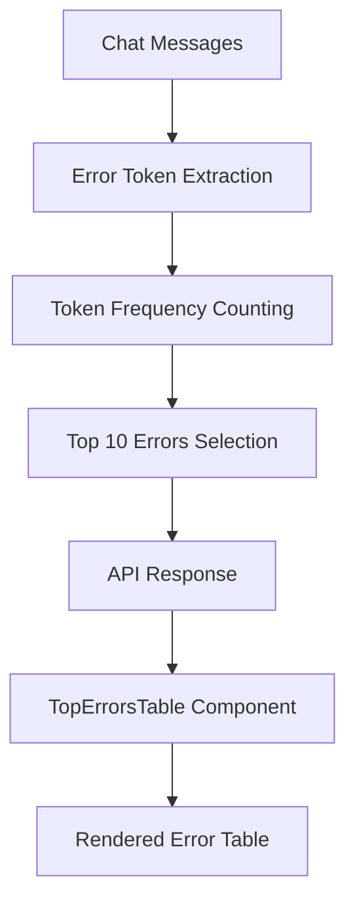
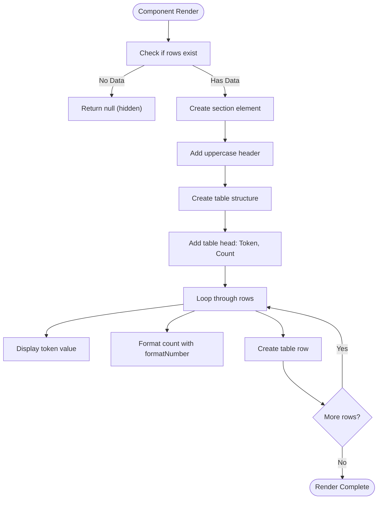
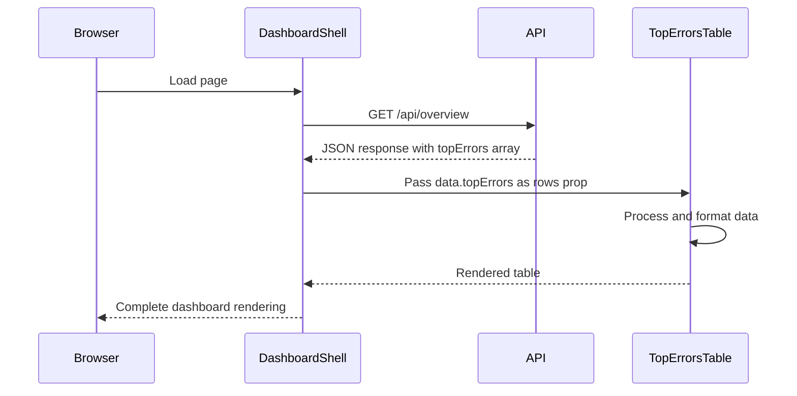

# Top Errors Table

<cite>
**Referenced Files in This Document**
- [TopErrorsTable.tsx](file://app/components/tables/TopErrorsTable.tsx)
- [useNumberFormatter.ts](file://app/hooks/useNumberFormatter.ts)
- [DashboardShell.tsx](file://app/components/DashboardShell.tsx)
- [slice.ts](file://lib/report/slice.ts)
- [route.ts](file://app/api/overview/route.ts)
</cite>

## Table of Contents
1. [Introduction](#introduction)
2. [Core Components](#core-components)
3. [Architecture Overview](#architecture-overview)
4. [Detailed Component Analysis](#detailed-component-analysis)
5. [Data Processing Pipeline](#data-processing-pipeline)
6. [Integration and Usage](#integration-and-usage)
7. [Enhancement Opportunities](#enhancement-opportunities)

## Introduction
The Top Errors Table is a UI component designed to track frequent error tokens or keywords in developer-focused chat environments. It serves as a diagnostic tool for identifying recurring technical issues by analyzing message content for common error patterns. The component displays the most frequently occurring error tokens alongside their occurrence counts, enabling teams to quickly identify and address systemic problems in their development workflows.

## Core Components

This section analyzes the primary implementation files that constitute the Top Errors Table functionality.

**Section sources**
- [TopErrorsTable.tsx](file://app/components/tables/TopErrorsTable.tsx#L1-L27)
- [useNumberFormatter.ts](file://app/hooks/useNumberFormatter.ts#L1-L13)

## Architecture Overview

The Top Errors Table operates within a larger dashboard architecture that collects, processes, and visualizes chat analytics data. The component receives pre-processed error data from an API endpoint and renders it in a compact, readable format. Error detection occurs at the data processing layer, where message text is scanned for predefined error patterns before being aggregated and sorted by frequency.



**Diagram sources**
- [slice.ts](file://lib/report/slice.ts#L85-L106)
- [route.ts](file://app/api/overview/route.ts#L293-L314)
- [TopErrorsTable.tsx](file://app/components/tables/TopErrorsTable.tsx#L7-L23)

## Detailed Component Analysis

### TopErrorsTable Component
The TopErrorsTable component accepts an array of objects containing 'token' and 'cnt' properties, representing error keywords and their occurrence counts. It utilizes the useNumberFormatter hook to properly format count values for display. The component features minimalist design with an uppercase header labeled "Ошибки дня" (Errors of the Day) and employs a compact layout with limited height to fit within dashboard constraints.

When no error data is available (rows.length === 0), the component conditionally renders nothing, maintaining clean dashboard aesthetics during periods of low error activity. Each row in the table displays the error token and its formatted count using the application's number formatting standard.



**Diagram sources**
- [TopErrorsTable.tsx](file://app/components/tables/TopErrorsTable.tsx#L7-L23)

**Section sources**
- [TopErrorsTable.tsx](file://app/components/tables/TopErrorsTable.tsx#L7-L23)

## Data Processing Pipeline

### Error Token Extraction
The system extracts error tokens from chat messages using a regular expression pattern that identifies common error indicators such as uppercase words (3+ characters), terms like "error" or "exception", HTTP status codes (429, 403), and network-related issues ("timeout", "rate limit"). The extraction function normalizes tokens by preserving uppercase format for acronyms while converting general error terms to lowercase for consistent counting.

```mermaid
flowchart TD
A[Raw Message Text] --> B{Text exists?}
B --> |No| C[Return empty array]
B --> |Yes| D[Apply errorRegex]
D --> E[Match: [A-Z_]{3,}|[Ee]rror|Exception|ECONN|429|403|Forbidden|timeout|rate\\s*limit]
E --> F[Collect matches]
F --> G{Process each match}
G --> H[/^[A-Z_]{3,}$/ ? Keep uppercase : Convert to lowercase]
H --> I[Add to tokens array]
I --> J{More matches?}
J --> |Yes| G
J --> |No| K[Return processed tokens]
```

**Diagram sources**
- [slice.ts](file://lib/report/slice.ts#L85-L106)

### Error Aggregation Process
After token extraction, the system aggregates occurrences using Map objects to count frequency. Error tokens are sorted by count in descending order, and the top 10 results are selected for display in the Top Errors Table. This aggregation occurs in both the buildDailyPreview function for report generation and directly in the API route for real-time data.

**Section sources**
- [slice.ts](file://lib/report/slice.ts#L279-L308)
- [route.ts](file://app/api/overview/route.ts#L293-L314)

## Integration and Usage

### Dashboard Integration
The TopErrorsTable is integrated into the main dashboard layout through the DashboardShell component, which orchestrates the placement of various analytics tables. It is positioned among other key metrics components and receives its data from the API overview endpoint via the data.topErrors property.

The component uses the Tailwind CSS class "lg:col-span-1" to allocate one column in the large-screen grid layout, ensuring proportional space distribution among sibling components. This responsive design approach allows the table to occupy appropriate space relative to other dashboard elements.



**Diagram sources**
- [DashboardShell.tsx](file://app/components/DashboardShell.tsx#L73)
- [route.ts](file://app/api/overview/route.ts#L500-L520)
- [TopErrorsTable.tsx](file://app/components/tables/TopErrorsTable.tsx#L7-L23)

**Section sources**
- [DashboardShell.tsx](file://app/components/DashboardShell.tsx#L73)
- [route.ts](file://app/api/overview/route.ts#L500-L520)

### Practical Example
A practical example of the TopErrorsTable in action would display common error types such as:
- "TypeError" - 24 occurrences
- "429" - 18 occurrences
- "timeout" - 15 occurrences
- "null_pointer" - 12 occurrences
- "ECONNREFUSED" - 9 occurrences
- "rate limit" - 7 occurrences
- "segmentation_fault" - 5 occurrences

These entries help development teams immediately identify whether they're facing rate limiting issues, connection problems, or specific code-level exceptions that require attention.

## Enhancement Opportunities

### External Issue Tracker Integration
The TopErrorsTable could be enhanced with integration capabilities for external issue tracking systems. Potential integrations include:
- Direct links to create Jira tickets from frequent errors
- GitHub issue creation buttons next to high-frequency error tokens
- Integration with Sentry or similar error monitoring platforms
- Clickable error tokens that search documentation or knowledge bases

### Advanced Error Management Features
Future enhancements could include:
- **Error categorization**: Grouping similar errors into categories (network, database, authentication)
- **Suppression rules**: Allowing teams to filter out known benign errors
- **Trend analysis**: Showing whether specific errors are increasing or decreasing over time
- **Contextual linking**: Providing direct links to example messages containing each error
- **Severity scoring**: Automatically assigning severity levels based on error type and frequency

These enhancements would transform the TopErrorsTable from a simple frequency counter into a comprehensive error management dashboard component.

**Section sources**
- [slice.ts](file://lib/report/slice.ts#L85-L106)
- [TopErrorsTable.tsx](file://app/components/tables/TopErrorsTable.tsx#L7-L23)