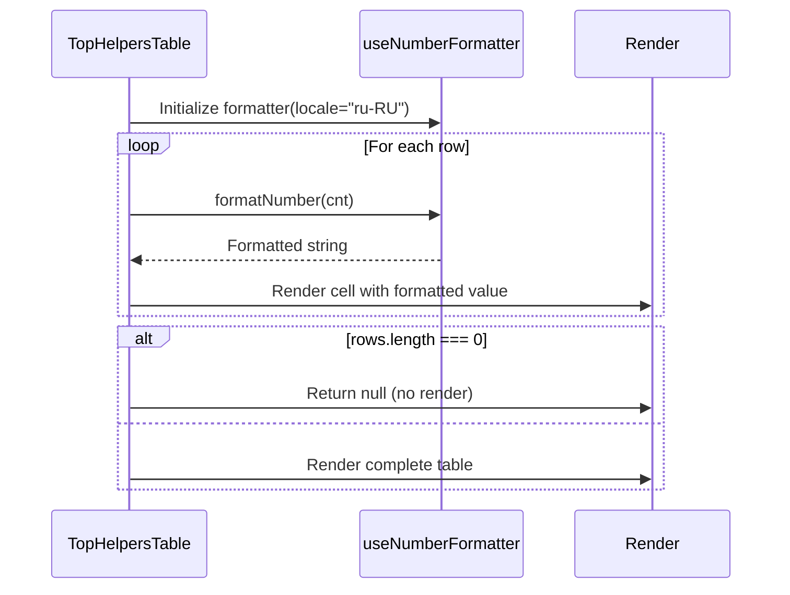
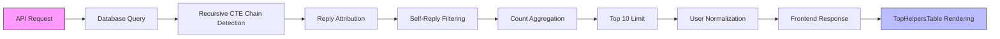

# Top Helpers Table

<cite>
**Referenced Files in This Document**   
- [TopHelpersTable.tsx](file://app/components/tables/TopHelpersTable.tsx)
- [useNumberFormatter.ts](file://app/hooks/useNumberFormatter.ts)
- [DashboardShell.tsx](file://app/components/DashboardShell.tsx)
- [route.ts](file://app/api/overview/route.ts)
</cite>

## Table of Contents
1. [Introduction](#introduction)
2. [Component Function and Purpose](#component-function-and-purpose)
3. [Props Interface Definition](#props-interface-definition)
4. [Visual Design and Layout](#visual-design-and-layout)
5. [Data Formatting and Null State Handling](#data-formatting-and-null-state-handling)
6. [Data Source and Backend Logic](#data-source-and-backend-logic)
7. [Community Engagement Impact](#community-engagement-impact)
8. [Example Usage with Sample Data](#example-usage-with-sample-data)
9. [Privacy Considerations](#privacy-considerations)
10. [Potential Extensions](#potential-extensions)

## Introduction
The Top Helpers Table is a UI component within the Telegram Dashboard application designed to recognize and display active contributors based on their reply activity. This documentation provides comprehensive details about its implementation, functionality, data flow, and design principles.

## Component Function and Purpose
The Top Helpers Table serves as a recognition mechanism for community members who actively participate by responding to others' messages in discussion threads. It identifies users who contribute answers in conversations initiated by other participants, thereby fostering a culture of helpfulness and engagement within the community.

This component plays a crucial role in promoting positive participation by making visible those who consistently provide support and information to fellow members. By highlighting these contributors, it encourages knowledge sharing and creates informal leadership roles within the community ecosystem.

**Section sources**
- [TopHelpersTable.tsx](file://app/components/tables/TopHelpersTable.tsx#L6-L22)
- [route.ts](file://app/api/overview/route.ts#L207-L242)

## Props Interface Definition
The component accepts a single prop named `rows` which is an optional array of objects containing two fields:
- `user`: string representing the helper's identifier (username or full name)
- `cnt`: number representing the count of replies made by that user

The type definition establishes a clear contract for data consumption, ensuring type safety and predictable behavior when rendering contribution statistics.

```mermaid
classDiagram
class TopHelpersTableProps {
+rows : Array<{user : string, cnt : number}>
}
class Row {
+user : string
+cnt : number
}
TopHelpersTableProps --> Row : "contains"
```

**Diagram sources**
- [TopHelpersTable.tsx](file://app/components/tables/TopHelpersTable.tsx#L4-L5)

**Section sources**
- [TopHelpersTable.tsx](file://app/components/tables/TopHelpersTable.tsx#L4-L5)

## Visual Design and Layout
The component follows a consistent visual design language shared with other ranking tables in the dashboard. It features a clean, minimalistic presentation with proper typography hierarchy and spacing.

Key layout characteristics include:
- Responsive grid placement using Tailwind CSS classes
- Fixed height with overflow scrolling for long lists
- Consistent panel styling across dashboard components
- Clear header with uppercase formatting for section identification

The component occupies one column in large screen layouts through the `lg:col-span-1` CSS class, allowing it to be positioned alongside other metrics while maintaining readability.

```mermaid
flowchart TD
A["Panel Container"] --> B["Header: 'Helpers — лидеры'"]
A --> C["Table Structure"]
C --> D["Table Head: Пользователь | Ответов"]
C --> E["Table Body: User Rows"]
E --> F["User Display"]
E --> G["Formatted Reply Count"]
style A cssClass "panel lg:col-span-1 overflow-auto max-h-64 space-y-2"
style B cssClass "text-xs uppercase font-bold text-gray-500 tracking-wider"
```

**Diagram sources**
- [TopHelpersTable.tsx](file://app/components/tables/TopHelpersTable.tsx#L8-L10)

**Section sources**
- [TopHelpersTable.tsx](file://app/components/tables/TopHelpersTable.tsx#L8-L10)
- [DashboardShell.tsx](file://app/components/DashboardShell.tsx#L78)

## Data Formatting and Null State Handling
The component implements robust data handling practices including number formatting and conditional rendering. It utilizes the `useNumberFormatter` hook to format reply counts according to locale-specific conventions, enhancing readability for international users.

A key feature is its null state handling: when no helper data is available (empty rows array), the component returns null rather than rendering an empty table. This prevents unnecessary UI clutter and maintains a clean interface when data is unavailable.

The formatting function automatically handles various numeric types and edge cases such as null or undefined values, ensuring consistent presentation regardless of input quality.



**Diagram sources**
- [TopHelpersTable.tsx](file://app/components/tables/TopHelpersTable.tsx#L7-L9)
- [useNumberFormatter.ts](file://app/hooks/useNumberFormatter.ts#L2-L9)

**Section sources**
- [TopHelpersTable.tsx](file://app/components/tables/TopHelpersTable.tsx#L7-L9)
- [useNumberFormatter.ts](file://app/hooks/useNumberFormatter.ts#L2-L9)

## Data Source and Backend Logic
The data displayed in the Top Helpers Table originates from the `/api/overview` endpoint, which queries a PostgreSQL database to identify users who have replied in threads started by others. The backend logic employs a recursive CTE (Common Table Expression) to trace message chains and accurately attribute replies to their respective threads.

The query specifically excludes cases where users reply to their own messages, focusing only on cross-user assistance. Results are limited to the top 10 helpers and ordered by contribution count in descending order. User identifiers are normalized through the `normalizeUsernameOrId` function, which intelligently combines username, first name, and last name information into a readable format.



**Diagram sources**
- [route.ts](file://app/api/overview/route.ts#L207-L242)
- [TopHelpersTable.tsx](file://app/components/tables/TopHelpersTable.tsx#L20-L22)

**Section sources**
- [route.ts](file://app/api/overview/route.ts#L207-L242)
- [TopHelpersTable.tsx](file://app/components/tables/TopHelpersTable.tsx#L20-L22)

## Community Engagement Impact
By publicly recognizing helpful behavior, the Top Helpers Table creates positive reinforcement for constructive participation. This metric-driven recognition system encourages users to engage more deeply with community discussions, knowing their contributions are visible and valued.

The psychological impact includes:
- Increased motivation to help others
- Development of informal mentorship relationships
- Enhanced sense of community ownership
- Greater overall discussion quality

Unlike simple message count metrics, this approach specifically rewards collaborative behavior—answering questions and supporting peers—which aligns with healthy community dynamics rather than mere posting frequency.

## Example Usage with Sample Data
The component would render with sample data as follows:

| Пользователь | Ответов |
|-------------|--------|
| @tech_guru | 24 |
| Alex Smith (@alexdev) | 18 |
| Maria K. | 15 |
| @code_wizard | 12 |
| John Doe | 9 |

In this example, four users are recognized for their assistance, with reply counts properly formatted according to locale rules. The table would appear in its designated grid position, scrolling if necessary to accommodate all entries while maintaining the overall dashboard layout integrity.

**Section sources**
- [TopHelpersTable.tsx](file://app/components/tables/TopHelpersTable.tsx#L11-L19)

## Privacy Considerations
The component handles user identification with privacy awareness by:
- Using normalized identifiers that respect user preferences (prioritizing usernames over IDs)
- Combining available name information without exposing sensitive data
- Falling back to ID-only display only when no public identifiers exist
- Avoiding display of personally identifiable information beyond what users have already shared

The system respects Telegram's privacy model by working exclusively with information that users have chosen to make visible in their profiles or message metadata.

**Section sources**
- [route.ts](file://app/api/overview/route.ts#L20-L35)
- [TopHelpersTable.tsx](file://app/components/tables/TopHelpersTable.tsx#L20)

## Potential Extensions
Several valuable enhancements could extend the component's functionality:

### Role-Based Filtering
Implement filtering options to show helpers within specific community roles or expertise areas, allowing targeted recognition of domain-specific contributors.

### Streak Tracking
Add consecutive day participation metrics to recognize sustained engagement patterns, complementing the cumulative count with temporal consistency data.

### Contribution Quality Metrics
Integrate sentiment analysis or peer feedback mechanisms to assess not just quantity but quality of responses, potentially weighting contributions accordingly.

### Time Range Comparison
Enable comparison of helper rankings across different time periods to identify emerging contributors and track engagement trends.

### Badging System
Develop a visual badge system that awards icons or special indicators for reaching contribution milestones, adding gamification elements to encourage participation.