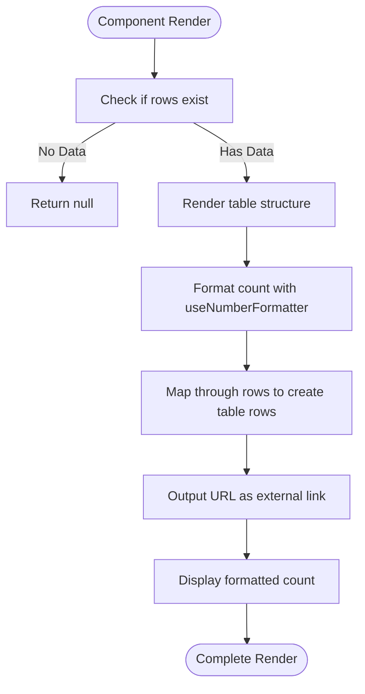
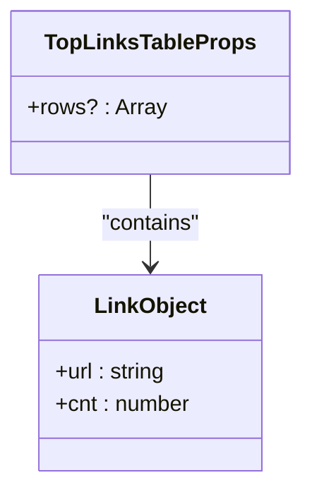
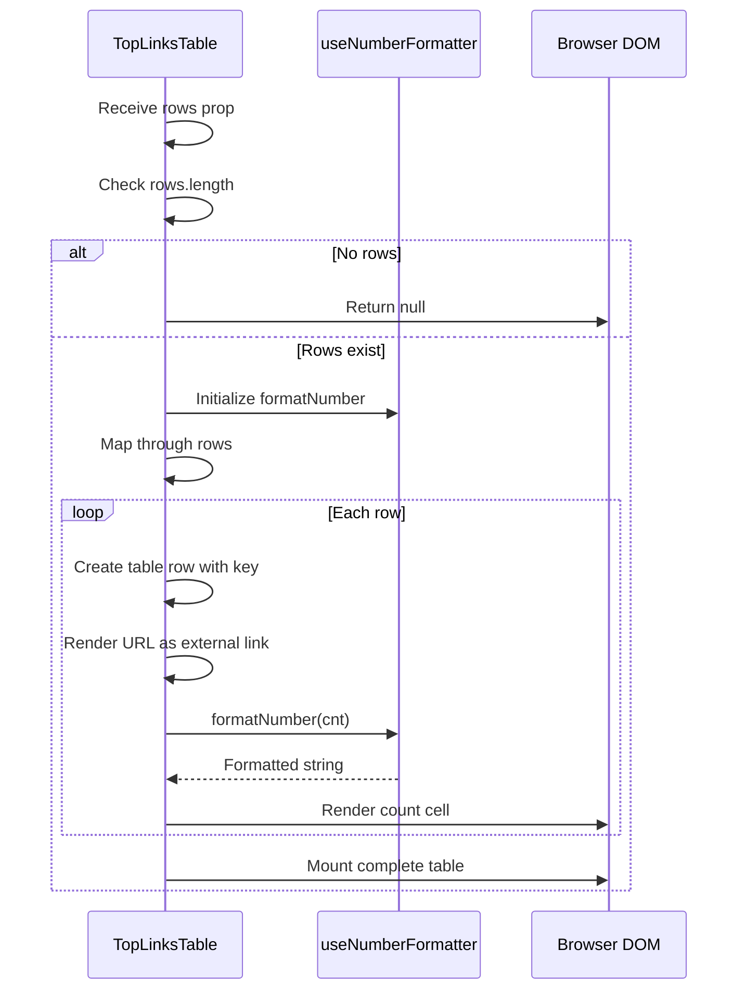
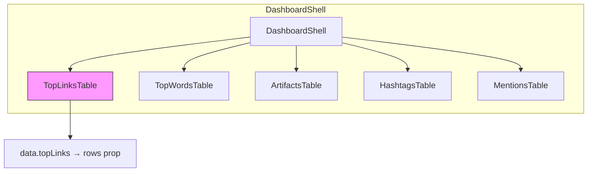

# Top Links Table

<cite>
**Referenced Files in This Document**
- [TopLinksTable.tsx](file://app/components/tables/TopLinksTable.tsx)
- [useNumberFormatter.ts](file://app/hooks/useNumberFormatter.ts)
- [DashboardShell.tsx](file://app/components/DashboardShell.tsx)
- [schema.ts](file://lib/report/schema.ts)
- [slice.ts](file://lib/report/slice.ts)
</cite>

## Table of Contents
1. [Introduction](#introduction)
2. [Component Overview](#component-overview)
3. [Props Interface](#props-interface)
4. [Rendering Logic](#rendering-logic)
5. [Styling and Layout](#styling-and-layout)
6. [Integration in Dashboard](#integration-in-dashboard)
7. [Code Example](#code-example)
8. [Accessibility Considerations](#accessibility-considerations)
9. [Potential Enhancements](#potential-enhancements)

## Introduction
The TopLinksTable component is a UI element within the Telegram chat analytics dashboard that displays the most frequently shared URLs. It provides insights into content trends by showing links and their share counts, helping users identify popular resources discussed in chats.

**Section sources**
- [TopLinksTable.tsx](file://app/components/tables/TopLinksTable.tsx#L1-L32)

## Component Overview
TopLinksTable is a client-side React component designed to render a table of the most frequently shared URLs from Telegram chat data. The component conditionally renders based on data availability and formats link counts using internationalization standards. It plays a key role in the analytics dashboard by visualizing URL sharing patterns.



**Diagram sources**
- [TopLinksTable.tsx](file://app/components/tables/TopLinksTable.tsx#L8-L29)

**Section sources**
- [TopLinksTable.tsx](file://app/components/tables/TopLinksTable.tsx#L1-L32)

## Props Interface
The component accepts a single prop `rows` of type `Array<{ url: string; cnt: number }>` which is optional and defaults to an empty array. This interface aligns with the data structure defined in the application's schema for top links reporting.



**Diagram sources**
- [TopLinksTable.tsx](file://app/components/tables/TopLinksTable.tsx#L4-L6)
- [schema.ts](file://lib/report/schema.ts#L15)

**Section sources**
- [TopLinksTable.tsx](file://app/components/tables/TopLinksTable.tsx#L4-L6)
- [schema.ts](file://lib/report/schema.ts#L15)

## Rendering Logic
The component implements conditional rendering logic that returns null when no data is present. For valid data, it maps through the rows array to generate table entries. Each URL is rendered as an anchor tag with appropriate security attributes, and the count values are formatted using the useNumberFormatter hook for consistent number presentation across locales.



**Diagram sources**
- [TopLinksTable.tsx](file://app/components/tables/TopLinksTable.tsx#L8-L29)
- [useNumberFormatter.ts](file://app/hooks/useNumberFormatter.ts#L2-L9)

**Section sources**
- [TopLinksTable.tsx](file://app/components/tables/TopLinksTable.tsx#L8-L29)
- [useNumberFormatter.ts](file://app/hooks/useNumberFormatter.ts#L2-L9)

## Styling and Layout
The component utilizes Tailwind CSS classes for responsive styling. The container uses "panel" for consistent card styling across the dashboard, "overflow-auto" for scrollable content when exceeding limits, and "max-h-64" to constrain maximum height. Spacing between elements is managed with "space-y-2". These styles ensure the component fits well within various screen sizes and maintains visual consistency.

**Section sources**
- [TopLinksTable.tsx](file://app/components/tables/TopLinksTable.tsx#L10)

## Integration in Dashboard
TopLinksTable is integrated within the DashboardShell component using responsive grid utilities. It resides in a flex container with "lg:col-span-3" applied to its parent grid, allowing it to span three columns on large screens while adapting to smaller layouts. The component receives its data directly from the API response via the DashboardShell's data state.



**Diagram sources**
- [DashboardShell.tsx](file://app/components/DashboardShell.tsx#L70-L102)
- [slice.ts](file://lib/report/slice.ts#L15)

**Section sources**
- [DashboardShell.tsx](file://app/components/DashboardShell.tsx#L70-L102)
- [slice.ts](file://lib/report/slice.ts#L15)

## Code Example
A typical usage example involves passing an array of link objects to the component. While actual data comes from API responses, a mock implementation would follow this pattern:

```tsx
<TopLinksTable 
  rows={[
    { url: "https://example.com/resource", cnt: 24 },
    { url: "https://another-site.org/document", cnt: 18 },
    { url: "https://third-link.net/page", cnt: 12 }
  ]} 
/>
```

This would render a table with three entries, each showing the full URL as a clickable link and the formatted count value.

**Section sources**
- [TopLinksTable.tsx](file://app/components/tables/TopLinksTable.tsx#L8-L29)

## Accessibility Considerations
The component includes several accessibility features. External links open in new tabs with proper `target="_blank"` and security-preserving `rel="noreferrer noopener"` attributes. The table structure provides inherent semantic meaning, with header cells properly defining column purposes. Future enhancements could include ARIA labels for screen readers and keyboard navigation improvements.

**Section sources**
- [TopLinksTable.tsx](file://app/components/tables/TopLinksTable.tsx#L20)

## Potential Enhancements
Possible improvements to the component include domain grouping to consolidate similar URLs, click tracking with analytics events, URL preview tooltips, sorting controls, and expanded metadata display. Additional features could involve filtering options, export functionality, or integration with link shortening services for better readability of long URLs.

**Section sources**
- [TopLinksTable.tsx](file://app/components/tables/TopLinksTable.tsx#L8-L29)
- [slice.ts](file://lib/report/slice.ts#L289-L332)