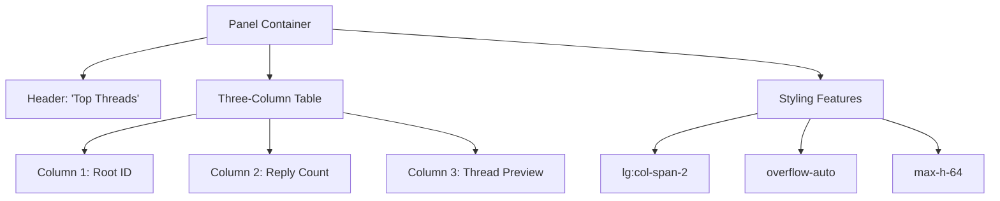
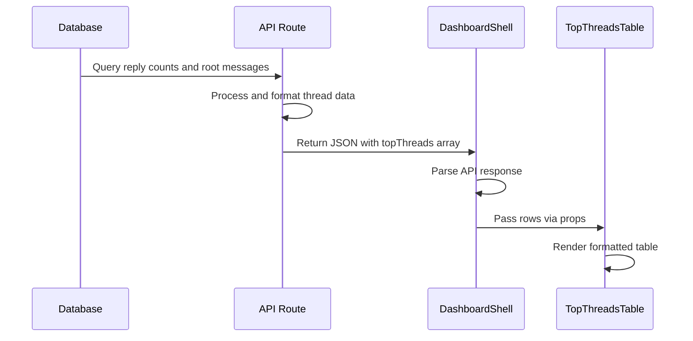

# Top Threads Table

<cite>
**Referenced Files in This Document**   
- [TopThreadsTable.tsx](file://app/components/tables/TopThreadsTable.tsx)
- [useNumberFormatter.ts](file://app/hooks/useNumberFormatter.ts)
- [DashboardShell.tsx](file://app/components/DashboardShell.tsx)
- [slice.ts](file://lib/report/slice.ts)
- [schema.ts](file://lib/report/schema.ts)
- [route.ts](file://app/api/overview/route.ts)
</cite>

## Table of Contents
1. [Introduction](#introduction)
2. [Component Overview](#component-overview)
3. [Props Structure](#props-structure)
4. [Layout and Styling](#layout-and-styling)
5. [Data Formatting](#data-formatting)
6. [Integration and Data Flow](#integration-and-data-flow)
7. [Usage Example](#usage-example)
8. [Limitations and Enhancement Opportunities](#limitations-and-enhancement-opportunities)
9. [Conclusion](#conclusion)

## Introduction
The TopThreadsTable component is a UI element designed to display the most active message threads within a Telegram chat analytics dashboard. It identifies discussions with the highest number of replies, providing insights into community engagement patterns. The component renders thread data in a tabular format with optimized layout for readability and integrates seamlessly within the dashboard's responsive grid system.

## Component Overview

The TopThreadsTable component serves as a visualization tool for identifying high-engagement message threads by ranking them according to reply count. It processes an array of thread objects containing root message identifiers, reply counts, and preview text to generate a scrollable table display. When no data is available, the component returns null rather than rendering empty content, maintaining clean UI presentation.

The component operates as a client-side React functional component, leveraging hooks for number formatting functionality. It displays threads in descending order of reply count, highlighting the most discussed topics within the analyzed time window.

**Section sources**
- [TopThreadsTable.tsx](file://app/components/tables/TopThreadsTable.tsx#L6-L22)

## Props Structure

The component accepts a single prop object with the following structure:

- **rows**: Optional array of thread objects, each containing:
  - `root_id`: Unique identifier (string or number) for the root message of the thread
  - `replies`: Numeric count of replies within the thread
  - `root_preview`: Text preview of the root message content

The props interface uses TypeScript type annotation to ensure type safety, with default initialization to an empty array when no rows are provided. This design allows flexible integration with various data sources while maintaining consistent data expectations.

**Section sources**
- [TopThreadsTable.tsx](file://app/components/tables/TopThreadsTable.tsx#L4-L5)

## Layout and Styling

The component implements a responsive three-column table layout within a panel container. The design prioritizes readability through several key styling decisions:

- **Extended Width**: Utilizes the Tailwind CSS class `lg:col-span-2` to occupy two columns in the dashboard's grid layout on large screens, providing ample space for thread previews
- **Overflow Handling**: Implements `overflow-auto` with a constrained maximum height (`max-h-64`) to enable scrolling within the table when content exceeds available space
- **Visual Hierarchy**: Applies spacing (`space-y-2`) between elements and uses typographic styling (uppercase, bold font weight) for the section header to establish clear visual hierarchy
- **Responsive Design**: Adapts to different screen sizes through the use of responsive utility classes from Tailwind CSS

This layout ensures optimal information density while maintaining usability across device sizes.



**Diagram sources**
- [TopThreadsTable.tsx](file://app/components/tables/TopThreadsTable.tsx#L6-L22)

## Data Formatting

The component leverages the `useNumberFormatter` hook to format reply counts with locale-aware number formatting. This hook utilizes the browser's `Intl.NumberFormat` API with Russian locale ("ru-RU") as default, ensuring proper digit grouping and formatting according to regional conventions.

The `formatNumber` function handles various numeric input types including numbers, bigints, and nullable values, converting them to properly formatted string representations. For example, a reply count of 1000 would be displayed as "1 000" with a non-breaking space as the thousand separator, enhancing readability of large numbers.

Thread preview text is displayed as-is, relying on preprocessing that truncates long messages with an ellipsis indicator ("…") to prevent layout disruption.

**Section sources**
- [TopThreadsTable.tsx](file://app/components/tables/TopThreadsTable.tsx#L7-L8)
- [useNumberFormatter.ts](file://app/hooks/useNumberFormatter.ts#L4-L7)

## Integration and Data Flow

The TopThreadsTable component integrates within the dashboard's data flow architecture, receiving processed thread data from higher-level components. The data originates from database queries that analyze message relationships, specifically identifying messages that are replies to other messages.

In the backend processing logic, threads are identified by extracting the `reply_to_message` field from messages, counting replies per root message, and joining with the original message content to obtain preview text. The SQL query in `slice.ts` performs this aggregation, limiting results to the top 5 threads by reply count.

The component is integrated into the main dashboard layout through `DashboardShell`, where it receives filtered and sorted thread data via API response parsing. The data flows from the `/api/overview` endpoint through the dashboard state management system to the component's props.



**Diagram sources**
- [slice.ts](file://lib/report/slice.ts#L179-L192)
- [route.ts](file://app/api/overview/route.ts#L160-L166)
- [DashboardShell.tsx](file://app/components/DashboardShell.tsx#L85)

## Usage Example

A typical usage scenario involves displaying the five most replied-to messages from a selected time period. For example:

```typescript
<TopThreadsTable 
  rows={[
    { 
      root_id: "12345", 
      replies: 47, 
      root_preview: "How do I configure the new deployment pipeline? I'm encountering timeout issues during the build phase…" 
    },
    { 
      root_id: "12398", 
      replies: 32, 
      root_preview: "Great update! The new caching mechanism has improved response times significantly in our staging environment." 
    },
    { 
      root_id: "12415", 
      replies: 28, 
      root_preview: "Meeting reminder: Sprint planning session scheduled for tomorrow at 10:00 UTC. Please prepare your updates." 
    }
  ]} 
/>
```

This would render a table showing these three threads ranked by reply count, with properly formatted numbers and readable previews, integrated within the dashboard's two-column wide panel.

**Section sources**
- [TopThreadsTable.tsx](file://app/components/tables/TopThreadsTable.tsx#L6-L22)

## Limitations and Enhancement Opportunities

The current implementation has several limitations that present opportunities for enhancement:

### Current Limitations
- **No Navigation**: Users cannot click on threads to navigate to the actual conversation in Telegram
- **Limited Context**: Preview text may be truncated, potentially removing important context
- **Static Display**: No interactive features such as sorting, filtering, or drill-down capabilities
- **Language Constraint**: Header text is hardcoded in Russian, limiting internationalization

### Suggested Enhancements
- **Direct Linking**: Implement clickable thread entries that open the corresponding Telegram message using tg:// URLs or web links
- **Sentiment Analysis Overlay**: Integrate sentiment indicators to show not just engagement level but also discussion tone
- **Expanded Preview**: Add hover effects or click-to-expand functionality for truncated preview text
- **Interactive Filtering**: Allow users to filter threads by date range, user, or content type
- **Internationalization**: Convert static text to localization-ready strings for multi-language support
- **Visual Indicators**: Add icons or color coding to represent thread characteristics such as question vs. announcement

These enhancements would transform the component from a passive display to an interactive analysis tool, increasing its value for community managers and team leads monitoring discussion patterns.

**Section sources**
- [TopThreadsTable.tsx](file://app/components/tables/TopThreadsTable.tsx#L6-L22)
- [schema.ts](file://lib/report/schema.ts#L13)

## Conclusion
The TopThreadsTable component effectively fulfills its purpose of highlighting the most active discussions within a chat environment. Its clean design, responsive layout, and integration with the dashboard's data ecosystem make it a valuable tool for identifying engagement patterns. While the current implementation provides essential functionality, opportunities exist to enhance interactivity and analytical depth through navigation features and additional metadata visualization. The component's modular design and clear separation of concerns facilitate future enhancements while maintaining reliability in its core function of presenting top-performing threads by reply volume.