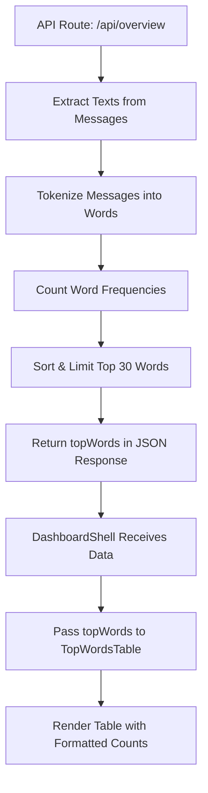
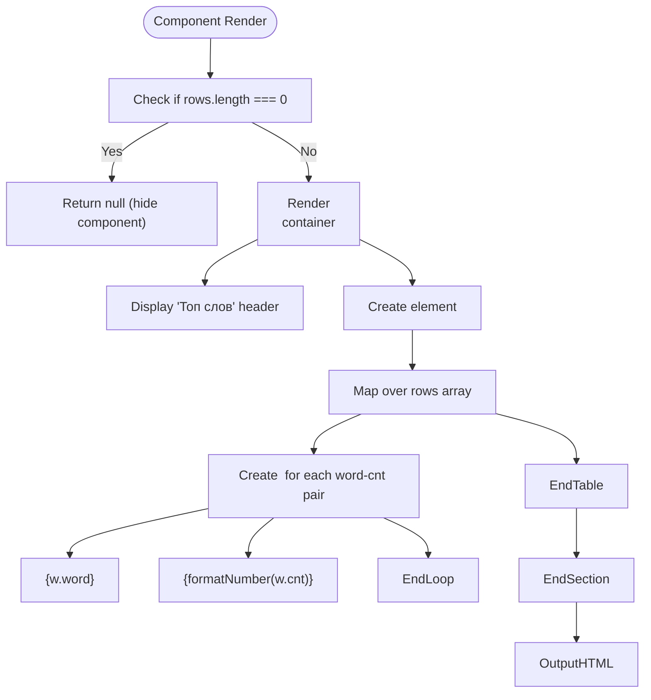

# Top Words Table

<cite>
**Referenced Files in This Document**
- [TopWordsTable.tsx](file://app/components/tables/TopWordsTable.tsx)
- [useNumberFormatter.ts](file://app/hooks/useNumberFormatter.ts)
- [DashboardShell.tsx](file://app/components/DashboardShell.tsx)
- [route.ts](file://app/api/overview/route.ts)
</cite>

## Table of Contents
1. [Introduction](#introduction)
2. [Core Components](#core-components)
3. [Architecture Overview](#architecture-overview)
4. [Detailed Component Analysis](#detailed-component-analysis)
5. [Integration and Data Flow](#integration-and-data-flow)
6. [Potential Improvements](#potential-improvements)

## Introduction
The **TopWordsTable** component is a UI element within the Telegram analytics dashboard that displays the most frequently used words in chat messages. It enables users to identify linguistic trends, popular topics, and community engagement patterns by visualizing word frequency data. The table renders up to 30 top words with their respective counts, formatted consistently using localization-aware number formatting. It supports responsive design constraints and conditional rendering when no data is available.

## Core Components

The TopWordsTable is a client-side React component designed for integration into a larger dashboard layout. It receives an optional array of word-frequency pairs and renders them in a structured tabular format. When no data is present, the component returns null, ensuring clean UI behavior. The component leverages reusable hooks for numeric formatting and follows consistent styling practices across the application.

**Section sources**
- [TopWordsTable.tsx](file://app/components/tables/TopWordsTable.tsx#L6-L22)

## Architecture Overview

**Diagram sources**
- [route.ts](file://app/api/overview/route.ts#L132-L137)
- [DashboardShell.tsx](file://app/components/DashboardShell.tsx#L66-L99)
- [TopWordsTable.tsx](file://app/components/tables/TopWordsTable.tsx#L6-L22)

## Detailed Component Analysis

### TopWordsTableProps Interface
The `TopWordsTableProps` interface defines the input contract for the component:
- `rows`: An optional array of objects, each containing:
  - `word`: A string representing the actual word extracted from messages
  - `cnt`: A numeric count indicating how many times the word appeared

This structure ensures type safety and clarity in data handling across the application.

**Section sources**
- [TopWordsTable.tsx](file://app/components/tables/TopWordsTable.tsx#L4-L4)

### Rendering Logic and Data Mapping
The component uses the `Array.map()` method to iterate over the provided `rows` array, generating a table row (`<tr>`) for each word-frequency pair. Each row is assigned a unique key based on its index. The word is displayed as plain text, while the count is processed through the `useNumberFormatter` hook before rendering.

Conditional rendering logic ensures the entire component returns `null` if the `rows` array is empty or undefined, preventing unnecessary DOM output.

**Diagram sources**
- [TopWordsTable.tsx](file://app/components/tables/TopWordsTable.tsx#L6-L22)

### Number Formatting with useNumberFormatter
The `useNumberFormatter` hook utilizes the browser's `Intl.NumberFormat` API with the default locale `"ru-RU"` to ensure consistent presentation of numeric values. This provides localized digit grouping (e.g., spaces as thousand separators) and handles edge cases like `null`, `undefined`, or `bigint` inputs gracefully by converting them to safe numeric representations before formatting.

**Section sources**
- [useNumberFormatter.ts](file://app/hooks/useNumberFormatter.ts#L4-L12)
- [TopWordsTable.tsx](file://app/components/tables/TopWordsTable.tsx#L7-L7)

### Visual Styling and Layout Constraints
The component employs Tailwind CSS classes to define its appearance and behavior:
- `panel`: Applies base styling common across dashboard components
- `overflow-auto`: Enables vertical scrolling when content exceeds container height
- `max-h-64`: Limits maximum height to 16rem (~256px), ensuring compact display
- `space-y-2`: Adds vertical spacing between child elements
- Header text uses `text-xs uppercase font-bold text-gray-500 tracking-wider` for a subdued, professional look aligned with design system standards

These styles ensure the table remains readable and visually consistent within the broader dashboard UI.

**Section sources**
- [TopWordsTable.tsx](file://app/components/tables/TopWordsTable.tsx#L8-L8)

## Integration and Data Flow

The TopWordsTable integrates seamlessly into the main dashboard layout via the `DashboardShell` component. It resides within a five-column grid section alongside other insight tables such as Top Links, Artifacts, Hashtags, and Mentions. The data flows from the backend API endpoint `/api/overview`, where SQL queries extract message texts, tokenize them using an `extractWords` function, count occurrences using a `Map<string, number>`, sort by frequency, and limit results to the top 30 entries before sending them to the frontend.

A practical example of rendered data might include:
- `{ word: "привет", cnt: 142 }`
- `{ word: "спасибо", cnt: 128 }`
- `{ word: "помогите", cnt: 97 }`

These would be displayed with properly formatted numbers (e.g., "142", "128") under the headers "Слово" (Word) and "Кол-во" (Count).

**Section sources**
- [DashboardShell.tsx](file://app/components/DashboardShell.tsx#L66-L99)
- [route.ts](file://app/api/overview/route.ts#L132-L137)
- [TopWordsTable.tsx](file://app/components/tables/TopWordsTable.tsx#L6-L22)

## Potential Improvements

Several enhancements could improve the utility and accuracy of the TopWordsTable:
- **Stop-word Filtering**: Exclude common filler words (e.g., "и", "в", "на", "the", "a") to focus on meaningful terms
- **Stemming Support**: Group word variants (e.g., "работаю", "работает", "работали") under a common root to avoid fragmentation
- **Case Normalization**: Convert all words to lowercase during processing to prevent duplicates due to capitalization
- **Punctuation Stripping**: Remove trailing punctuation to ensure accurate matching
- **Language Detection**: Apply different filtering rules based on detected language
- **User Configurable Count Threshold**: Allow hiding very low-frequency words
- **Clickable Words**: Enable drill-down functionality to view sample messages containing the word

Implementing these features would increase the analytical value of the component by reducing noise and highlighting more significant linguistic patterns.

**Section sources**
- [route.ts](file://app/api/overview/route.ts#L132-L137)
- [TopWordsTable.tsx](file://app/components/tables/TopWordsTable.tsx#L6-L22)