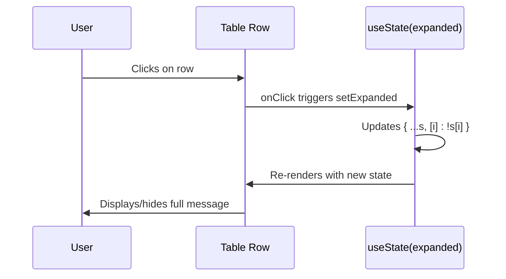
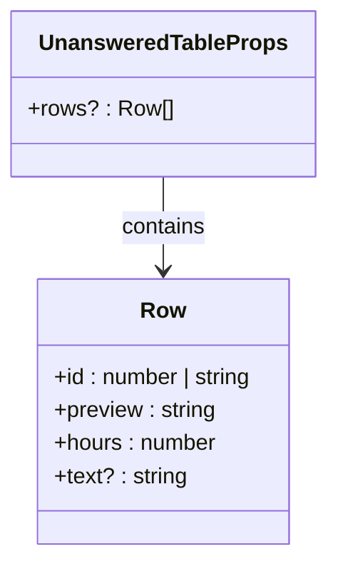
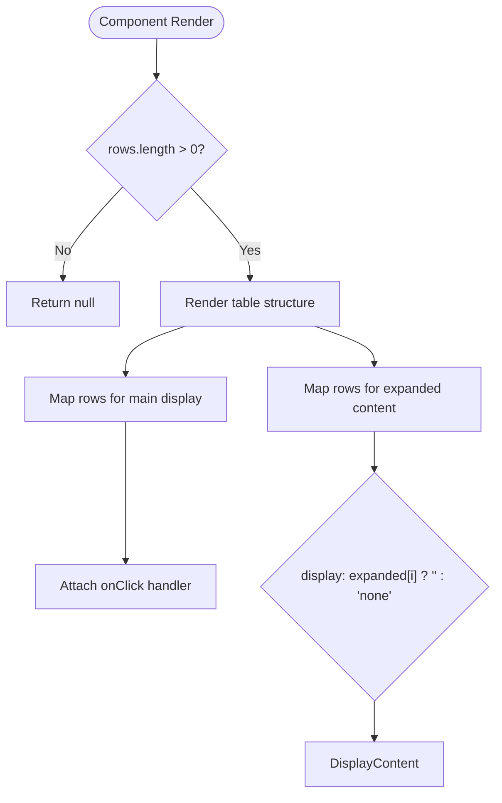

# Unanswered Questions Table

<cite>
**Referenced Files in This Document**  
- [UnansweredTable.tsx](file://app/components/tables/UnansweredTable.tsx)
- [useNumberFormatter.ts](file://app/hooks/useNumberFormatter.ts)
- [DashboardShell.tsx](file://app/components/DashboardShell.tsx)
</cite>

## Table of Contents
1. [Introduction](#introduction)
2. [Core Components](#core-components)
3. [State Management and Interaction](#state-management-and-interaction)
4. [Props Interface and Data Structure](#props-interface-and-data-structure)
5. [Rendering Strategy and Row Mapping](#rendering-strategy-and-row-mapping)
6. [Accessibility and UX Patterns](#accessibility-and-ux-patterns)
7. [Performance Considerations](#performance-considerations)
8. [Usage Example](#usage-example)

## Introduction
The `UnansweredTable` component is a critical UI element designed to surface unanswered questions that have remained without responses for more than 12 hours. By highlighting these stale queries, the component enhances community responsiveness and ensures important discussions are not overlooked. Implemented as a React client component, it leverages modern hooks and conditional rendering patterns to provide an interactive experience within a constrained height viewport.

**Section sources**
- [UnansweredTable.tsx](file://app/components/tables/UnansweredTable.tsx#L1-L32)

## Core Components

The `UnansweredTable` component renders a structured table displaying key metadata about unanswered messages, including their ID, preview text, and time elapsed in hours. It conditionally renders only when data is present and integrates with a number formatting hook for localized display. The component is embedded within the main dashboard layout via `DashboardShell`, receiving its data through props from upstream analytics processing.

```mermaid
flowchart TD
DashboardShell --> UnansweredTable: Passes 'rows' prop
UnansweredTable --> useNumberFormatter: Formats hour values
User --> UnansweredTable: Clicks row to expand
UnansweredTable --> DOM: Toggles hidden message content
```

**Diagram sources**
- [UnansweredTable.tsx](file://app/components/tables/UnansweredTable.tsx#L8-L32)
- [DashboardShell.tsx](file://app/components/DashboardShell.tsx#L10-L83)

**Section sources**
- [UnansweredTable.tsx](file://app/components/tables/UnansweredTable.tsx#L8-L32)
- [DashboardShell.tsx](file://app/components/DashboardShell.tsx#L10-L83)

## State Management and Interaction

The component utilizes the `useState` hook to manage the expansion state of individual rows using a record object (`Record<number, boolean>`), where each key corresponds to a row index and the value indicates whether that row is expanded. An `onClick` handler attached to each primary row toggles the visibility state by updating this record immutably—spreading the existing state and flipping the current row's boolean value.

This pattern enables independent control over multiple rows while maintaining reactivity and avoiding direct DOM manipulation.



**Diagram sources**
- [UnansweredTable.tsx](file://app/components/tables/UnansweredTable.tsx#L10-L11)
- [UnansweredTable.tsx](file://app/components/tables/UnansweredTable.tsx#L20-L21)

**Section sources**
- [UnansweredTable.tsx](file://app/components/tables/UnansweredTable.tsx#L10-L11)
- [UnansweredTable.tsx](file://app/components/tables/UnansweredTable.tsx#L20-L21)

## Props Interface and Data Structure

The component accepts a single optional prop `rows`, which defaults to an empty array. Each row conforms to the `Row` interface containing four fields:
- `id`: Unique identifier (string or number)
- `preview`: Brief summary of the message
- `hours`: Numeric value indicating time elapsed since posting
- `text?`: Optional full message content displayed upon expansion

This structure allows flexible data input while ensuring essential information is available for display and interaction logic.



**Diagram sources**
- [UnansweredTable.tsx](file://app/components/tables/UnansweredTable.tsx#L5-L6)

**Section sources**
- [UnansweredTable.tsx](file://app/components/tables/UnansweredTable.tsx#L5-L6)

## Rendering Strategy and Row Mapping

The component employs a dual mapping strategy across the same dataset:
1. **Primary Rows**: Render clickable entries showing ID, preview, and formatted hours
2. **Expanded Rows**: Conditionally render full message content beneath corresponding primary rows when expanded

Each mapped row uses a unique key (`i` for primary, `f-${i}` for expanded) to ensure React’s reconciliation works correctly. The second row set uses inline styles to toggle visibility based on the `expanded` state record, effectively showing or hiding detailed content without unmounting components.

**Section sources**
- [UnansweredTable.tsx](file://app/components/tables/UnansweredTable.tsx#L20-L30)

## Accessibility and UX Patterns

The `cursor-pointer` CSS class provides visual feedback indicating interactivity, enhancing discoverability for users. Hidden rows use `display: none` via inline style, which removes them from both layout and accessibility tree until expanded—ensuring screen readers do not announce invisible content prematurely.

The table maintains semantic structure with proper `<thead>` and `<tbody>` elements, supporting keyboard navigation and assistive technologies. However, explicit ARIA attributes (e.g., `aria-expanded`) could further improve accessibility by programmatically conveying expansion state.

**Section sources**
- [UnansweredTable.tsx](file://app/components/tables/UnansweredTable.tsx#L20-L29)

## Performance Considerations

While effective for moderate datasets, the current implementation may face performance challenges with large text payloads due to:
- Full message content being loaded upfront rather than on-demand
- Dual `.map()` operations iterating over the same array
- Lack of virtualization for long lists

Recommended improvements include:
- Implementing lazy loading via dynamic import or fetch-on-expand
- Generating truncated excerpts server-side to reduce payload size
- Using windowing libraries for large row sets to minimize DOM nodes
- Memoizing callbacks and child components to prevent unnecessary re-renders

These optimizations would enhance responsiveness and memory efficiency, particularly in scenarios with extensive conversation histories.

**Section sources**
- [UnansweredTable.tsx](file://app/components/tables/UnansweredTable.tsx#L1-L32)

## Usage Example

When rendered, the component displays a header labeled "Вопросы без ответа (>12ч)" followed by a table of unanswered items. Clicking any row toggles the visibility of its associated full message text directly below it. For instance, clicking a row with preview "How does auth work?" reveals the complete question in a gray, pre-wrapped text block spanning all columns.

The maximum height constraint `max-h-[360px]` ensures the table remains compact within the dashboard layout while allowing sufficient space for several expanded messages to be visible simultaneously.



**Diagram sources**
- [UnansweredTable.tsx](file://app/components/tables/UnansweredTable.tsx#L12-L30)

**Section sources**
- [UnansweredTable.tsx](file://app/components/tables/UnansweredTable.tsx#L12-L30)