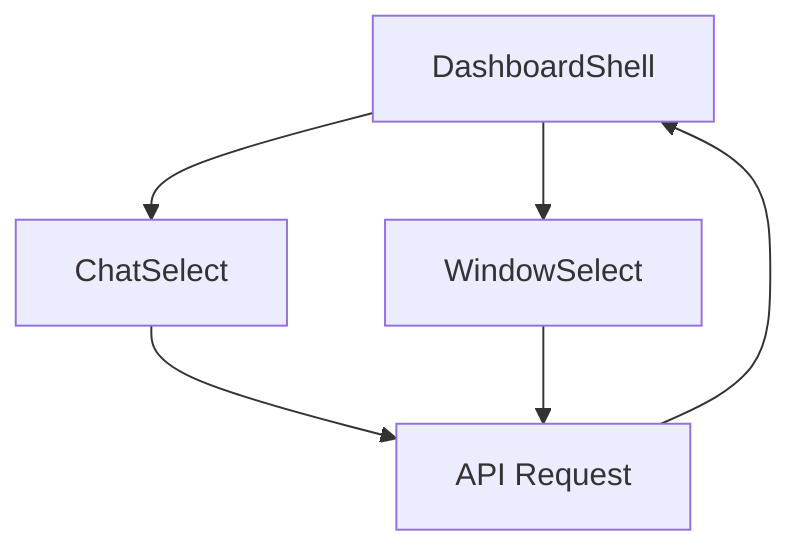
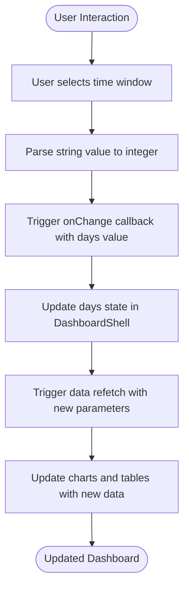
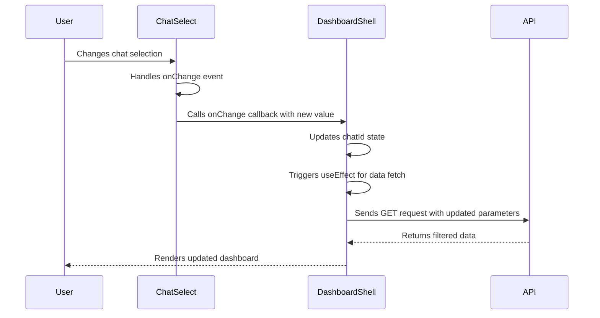

# Filter Components

<cite>
**Referenced Files in This Document**   
- [ChatSelect.tsx](file://app/components/filters/ChatSelect.tsx)
- [WindowSelect.tsx](file://app/components/filters/WindowSelect.tsx)
- [DashboardShell.tsx](file://app/components/DashboardShell.tsx)
- [route.ts](file://app/api/overview/route.ts)
</cite>

## Table of Contents
1. [Introduction](#introduction)
2. [Component Overview](#component-overview)
3. [ChatSelect Implementation](#chatselect-implementation)
4. [WindowSelect Implementation](#windowselect-implementation)
5. [State Management and Data Flow](#state-management-and-data-flow)
6. [Event Handling and Callback Propagation](#event-handling-and-callback-propagation)
7. [API Integration and URL Parameter Construction](#api-integration-and-url-parameter-construction)
8. [Accessibility Considerations](#accessibility-considerations)
9. [Styling and UI Consistency](#styling-and-ui-consistency)
10. [Conclusion](#conclusion)

## Introduction

The interactive filter components `ChatSelect` and `WindowSelect` serve as critical user interface elements for controlling data scope within the Telegram analytics dashboard. These components enable users to dynamically adjust the dataset being analyzed by selecting specific Telegram chats and time windows. The filters work in concert with the main data loader to provide a responsive, interactive experience that allows stakeholders to explore messaging patterns across different communication channels and temporal dimensions.

**Section sources**
- [ChatSelect.tsx](file://app/components/filters/ChatSelect.tsx#L1-L33)
- [WindowSelect.tsx](file://app/components/filters/WindowSelect.tsx#L1-L25)

## Component Overview

The dashboard features two primary filter components: `ChatSelect` for choosing between different Telegram chat contexts and `WindowSelect` for toggling between temporal analysis views. Both components are implemented as controlled React components that receive their current state via props and communicate changes through callback functions. They are positioned at the top of the dashboard layout within `DashboardShell`, providing immediate access to filtering controls.

**Diagram sources**
- [DashboardShell.tsx](file://app/components/DashboardShell.tsx#L22-L99)
- [ChatSelect.tsx](file://app/components/filters/ChatSelect.tsx#L10-L29)
- [WindowSelect.tsx](file://app/components/filters/WindowSelect.tsx#L7-L21)

## ChatSelect Implementation

The `ChatSelect` component renders a dropdown menu that allows users to select a specific Telegram chat for analysis or view aggregated data across all chats. It accepts three props: `chats` (an array of chat metadata objects), `value` (the currently selected chat ID), and `onChange` (a callback function triggered when selection changes).

When rendered, the component displays a label "Чат:" followed by a styled `<select>` element. The dropdown includes an initial "Все" option representing all chats, followed by options for each available chat. Each chat option displays the chat title (if available) along with its ID and message count. The component handles empty values by converting empty string selections back to `null` to maintain consistent state representation.

**Section sources**
- [ChatSelect.tsx](file://app/components/filters/ChatSelect.tsx#L10-L29)

## WindowSelect Implementation

The `WindowSelect` component provides temporal filtering by allowing users to choose between 24-hour and 7-day analytics views. It accepts two props: `value` (representing the number of days in the analysis window) and `onChange` (a callback for handling selection changes).

The component renders a label "Окно:" followed by a select dropdown with two options: "24 часа" (24 hours) with value 1, and "7 дней" (7 days) with value 7. When a user makes a selection, the component parses the string value back to an integer before passing it to the `onChange` callback. This numeric value directly influences both data fetching parameters and chart component selection within the dashboard.

**Diagram sources**
- [WindowSelect.tsx](file://app/components/filters/WindowSelect.tsx#L7-L21)
- [DashboardShell.tsx](file://app/components/DashboardShell.tsx#L22-L99)

## State Management and Data Flow

Both filter components participate in a centralized state management pattern orchestrated by the `DashboardShell` parent component. The shell maintains state for both the selected chat (`chatId`) and time window (`days`) using React's `useState` hook. Initial state is set based on component props, with a default 24-hour window.

When either filter value changes, the corresponding state setter function is called, triggering a re-render of `DashboardShell`. This state change activates the primary `useEffect` hook that manages data fetching. The effect listens to both `days` and `chatId` dependencies, ensuring that any filter modification initiates a new data request to the API endpoint.

An additional `useEffect` hook handles automatic chat selection when data first loads. If no chat has been explicitly selected and chat data is available, the component automatically selects the most active chat (first in the sorted list) to provide meaningful initial content.

**Section sources**
- [DashboardShell.tsx](file://app/components/DashboardShell.tsx#L22-L99)

## Event Handling and Callback Propagation

The filter components implement event handling through standard HTML form events that are translated into higher-level application logic. In `ChatSelect`, the `onChange` event listener on the `<select>` element processes the native event and converts the target value to the appropriate type (string or null) before invoking the passed `onChange` callback.

Similarly, `WindowSelect` handles the `onChange` event by parsing the string value from the select element back to an integer using `parseInt` with base 10. This ensures type consistency with the numeric state expected by the parent component.

Both callbacks are passed down from `DashboardShell` as state setter functions (`setChatId` and `setDays`), creating a unidirectional data flow where child components can influence parent state without direct manipulation.

**Diagram sources**
- [ChatSelect.tsx](file://app/components/filters/ChatSelect.tsx#L10-L29)
- [DashboardShell.tsx](file://app/components/DashboardShell.tsx#L22-L99)

## API Integration and URL Parameter Construction

The filter components directly influence API requests through URL parameter construction in `DashboardShell`. When data needs to be fetched, a `URLSearchParams` object is created and populated based on the current filter state. If the `days` value differs from the default (1), it is added as a 'days' parameter. Similarly, if a specific `chatId` is selected, it is added as a 'chat_id' parameter.

These parameters are then appended to the API endpoint URL (`/api/overview`) to create a query string that instructs the backend how to filter the results. The API route processes these parameters to constrain database queries to the specified time window and chat context, returning appropriately scoped analytics data.

The implementation includes abort controller functionality to prevent race conditions when rapid filter changes occur, ensuring that only the most recent request response is processed.

**Section sources**
- [DashboardShell.tsx](file://app/components/DashboardShell.tsx#L30-L45)
- [route.ts](file://app/api/overview/route.ts#L1-L523)

## Accessibility Considerations

Both filter components incorporate basic accessibility features through semantic HTML structure. The use of `<label>` elements paired with form controls provides screen reader support, clearly associating the descriptive text ("Чат:", "Окно:") with their respective interactive elements.

The native `<select>` elements inherently support keyboard navigation, allowing users to interact with the filters using tab navigation and arrow keys. However, the Russian language labels may present challenges for international users, and there are no