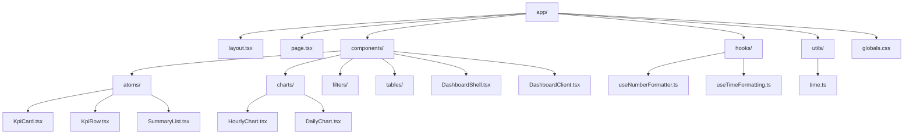
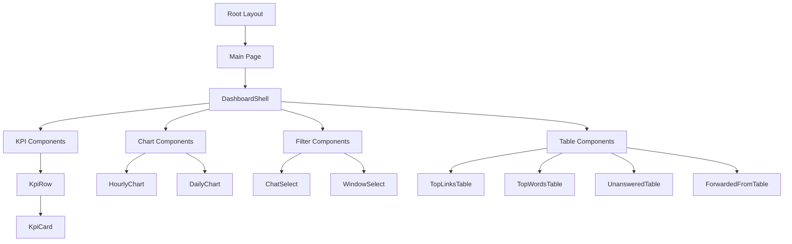
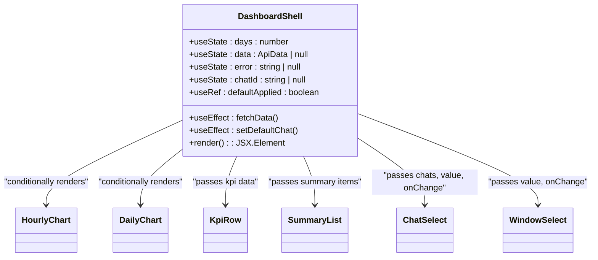
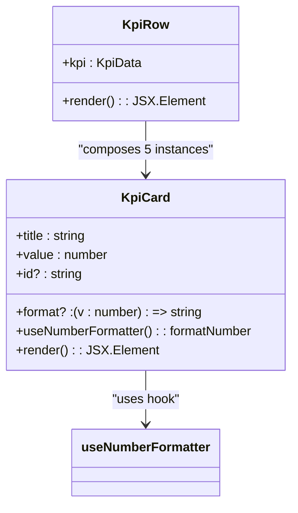
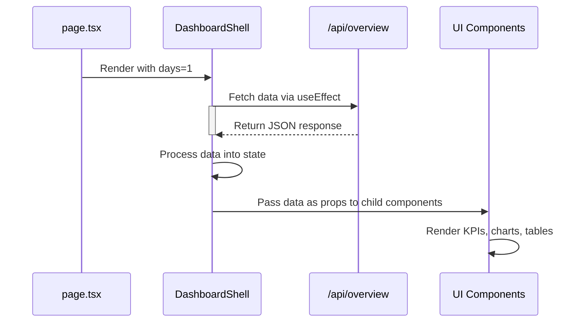
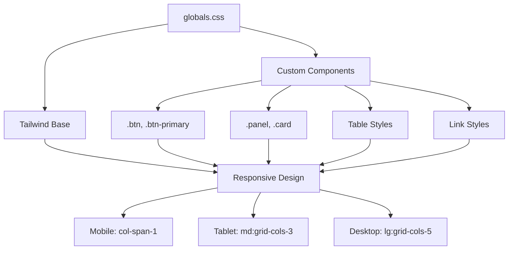

# Frontend Architecture

<cite>
**Referenced Files in This Document**   
- [layout.tsx](file://app/layout.tsx)
- [page.tsx](file://app/page.tsx)
- [DashboardShell.tsx](file://app/components/DashboardShell.tsx)
- [DashboardClient.tsx](file://app/components/DashboardClient.tsx)
- [KpiCard.tsx](file://app/components/atoms/KpiCard.tsx)
- [KpiRow.tsx](file://app/components/atoms/KpiRow.tsx)
- [SummaryList.tsx](file://app/components/atoms/SummaryList.tsx)
- [HourlyChart.tsx](file://app/components/charts/HourlyChart.tsx)
- [DailyChart.tsx](file://app/components/charts/DailyChart.tsx)
- [useNumberFormatter.ts](file://app/hooks/useNumberFormatter.ts)
- [useTimeFormatting.ts](file://app/hooks/useTimeFormatting.ts)
- [time.ts](file://app/utils/time.ts)
- [globals.css](file://app/globals.css)
</cite>

## Table of Contents
1. [Introduction](#introduction)
2. [Project Structure](#project-structure)
3. [Core Components](#core-components)
4. [Architecture Overview](#architecture-overview)
5. [Detailed Component Analysis](#detailed-component-analysis)
6. [Data Flow and Hydration](#data-flow-and-hydration)
7. [Styling and Responsive Design](#styling-and-responsive-design)
8. [Performance Considerations](#performance-considerations)
9. [Conclusion](#conclusion)

## Introduction
This document provides a comprehensive architectural overview of the frontend layer for the tg-vibecoders-dashboard application. It details the component hierarchy, atomic design patterns, client-side interactivity management, data flow from API responses, styling approach, and performance characteristics. The documentation is designed to serve both newcomers learning the UI structure and experts extending the interface.

## Project Structure

The application follows a Next.js App Router structure with clear separation of concerns:



**Diagram sources**
- [app/layout.tsx](file://app/layout.tsx#L1-L23)
- [app/page.tsx](file://app/page.tsx#L1-L24)
- [app/components/DashboardShell.tsx](file://app/components/DashboardShell.tsx#L1-L103)

**Section sources**
- [app/layout.tsx](file://app/layout.tsx#L1-L23)
- [app/page.tsx](file://app/page.tsx#L1-L24)

## Core Components

The frontend architecture is built around several core components that establish the foundation of the dashboard interface. The entry points `layout.tsx` and `page.tsx` bootstrap the application, while `DashboardShell.tsx` serves as the main container orchestrating all UI elements. Atomic components in the `atoms/` directory provide reusable building blocks, and chart components visualize time-series data.

**Section sources**
- [app/layout.tsx](file://app/layout.tsx#L1-L23)
- [app/page.tsx](file://app/page.tsx#L1-L24)
- [app/components/DashboardShell.tsx](file://app/components/DashboardShell.tsx#L1-L103)

## Architecture Overview

The frontend architecture follows a hierarchical composition pattern where higher-level components orchestrate lower-level atomic components. The application bootstraps through Next.js page routing, with `layout.tsx` providing the root HTML structure and `page.tsx` serving as the main entry point that renders the `DashboardShell` component.



**Diagram sources**
- [app/layout.tsx](file://app/layout.tsx#L1-L23)
- [app/page.tsx](file://app/page.tsx#L1-L24)
- [app/components/DashboardShell.tsx](file://app/components/DashboardShell.tsx#L1-L103)

## Detailed Component Analysis

### DashboardShell Component Analysis

The `DashboardShell` component serves as the central orchestrator of the dashboard UI, managing state, fetching data, and composing all visual elements. It implements client-side rendering with React hooks to handle dynamic interactions and data loading.



**Diagram sources**
- [app/components/DashboardShell.tsx](file://app/components/DashboardShell.tsx#L22-L99)

**Section sources**
- [app/components/DashboardShell.tsx](file://app/components/DashboardShell.tsx#L1-L103)

### Atomic Components Analysis

#### KpiCard and KpiRow Components
The atomic design pattern is implemented through the `KpiCard` and `KpiRow` components, which demonstrate composition and reusability principles. `KpiCard` represents the smallest unit for displaying key performance indicators, while `KpiRow` composes multiple `KpiCard` instances to create a cohesive row layout.



**Diagram sources**
- [app/components/atoms/KpiCard.tsx](file://app/components/atoms/KpiCard.tsx#L1-L24)
- [app/components/atoms/KpiRow.tsx](file://app/components/atoms/KpiRow.tsx#L1-L33)

**Section sources**
- [app/components/atoms/KpiCard.tsx](file://app/components/atoms/KpiCard.tsx#L1-L24)
- [app/components/atoms/KpiRow.tsx](file://app/components/atoms/KpiRow.tsx#L1-L33)

#### Chart Components
The charting functionality is implemented through `HourlyChart` and `DailyChart` components, which leverage Chart.js for data visualization. These components demonstrate proper cleanup patterns with useEffect and efficient re-rendering through useMemo.

```mermaid
classDiagram
class HourlyChart {
+since? : string
+hourlyRows? : Array<{ hour : string; cnt : number }>
+useRef : chartRef
+useRef : chartInstance
+useMemo : hourly data processing
+useEffect : chart initialization/cleanup
+render() : JSX.Element
}
class DailyChart {
+dailyRows? : Array<{ day : string; cnt : number }>
+useRef : canvasRef
+useRef : instance
+useEffect : chart initialization/cleanup
+render() : JSX.Element
}
HourlyChart --> build24hRange : "utilizes utility"
HourlyChart --> useTimeFormatting : "uses hook"
DailyChart --> useTimeFormatting : "uses hook"
```

**Diagram sources**
- [app/components/charts/HourlyChart.tsx](file://app/components/charts/HourlyChart.tsx#L1-L68)
- [app/components/charts/DailyChart.tsx](file://app/components/charts/DailyChart.tsx#L1-L46)

**Section sources**
- [app/components/charts/HourlyChart.tsx](file://app/components/charts/HourlyChart.tsx#L1-L68)
- [app/components/charts/DailyChart.tsx](file://app/components/charts/DailyChart.tsx#L1-L46)

### Utility Hooks Analysis

#### Number and Time Formatting Hooks
The application implements custom React hooks for formatting concerns, promoting reusability and separation of presentation logic. These hooks encapsulate internationalization and formatting behavior that can be shared across components.

```mermaid
classDiagram
class useNumberFormatter {
+locale : string
+formatter : Intl.NumberFormat
+formatNumber(value : number | bigint | null | undefined) : string
+returns : { formatNumber }
}
class useTimeFormatting {
+locale : string
+formatHourLocal(iso : string) : string
+formatDateLocal(iso : string | number | Date) : string
+returns : { formatHourLocal, formatDateLocal }
}
KpiCard --> useNumberFormatter : "consumes"
HourlyChart --> useTimeFormatting : "consumes"
DailyChart --> useTimeFormatting : "consumes"
```

**Diagram sources**
- [app/hooks/useNumberFormatter.ts](file://app/hooks/useNumberFormatter.ts#L1-L13)
- [app/hooks/useTimeFormatting.ts](file://app/hooks/useTimeFormatting.ts#L1-L18)

**Section sources**
- [app/hooks/useNumberFormatter.ts](file://app/hooks/useNumberFormatter.ts#L1-L13)
- [app/hooks/useTimeFormatting.ts](file://app/hooks/useTimeFormatting.ts#L1-L18)

## Data Flow and Hydration

The data flow in this application follows a server-to-client hydration pattern typical of Next.js applications. The `DashboardShell` component manages the entire data lifecycle, from initial fetch to error handling and loading states.



The data hydration process includes:
- Initial data fetching with AbortController for cleanup
- Loading state visualization with skeleton screens
- Error handling with user-friendly messages
- Conditional rendering based on data availability
- Proper cleanup of resources (chart instances, fetch controllers)

**Section sources**
- [app/components/DashboardShell.tsx](file://app/components/DashboardShell.tsx#L22-L99)
- [app/page.tsx](file://app/page.tsx#L1-L24)

## Styling and Responsive Design

The application uses Tailwind CSS for styling, with custom component classes defined in `globals.css`. The design is responsive and follows accessibility best practices.



The styling system includes:
- Global base styles imported from Tailwind
- Custom component classes using @apply directive
- Responsive grid layouts with col-span directives
- Accessibility features like proper contrast ratios
- Consistent spacing and typography system

**Section sources**
- [app/globals.css](file://app/globals.css#L1-L30)
- [app/layout.tsx](file://app/layout.tsx#L1-L23)

## Performance Considerations

The application implements several performance optimizations to ensure smooth user experience:

### Memoization and Efficient Re-renders
- `useMemo` is used in `HourlyChart` to prevent expensive data processing on