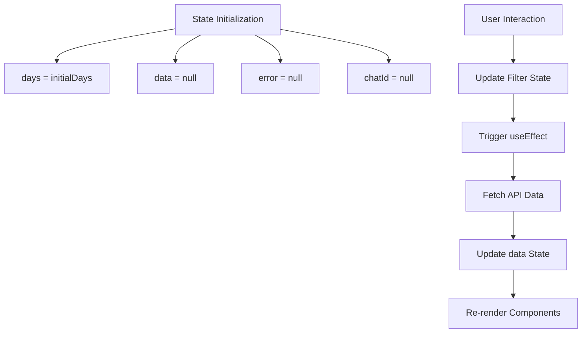
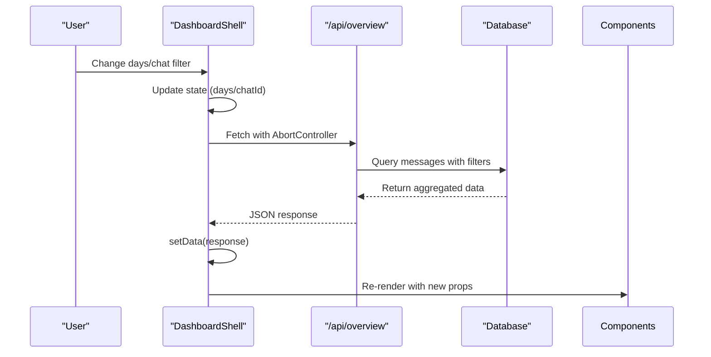
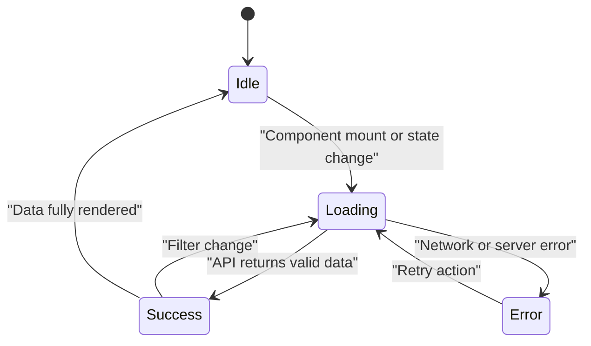
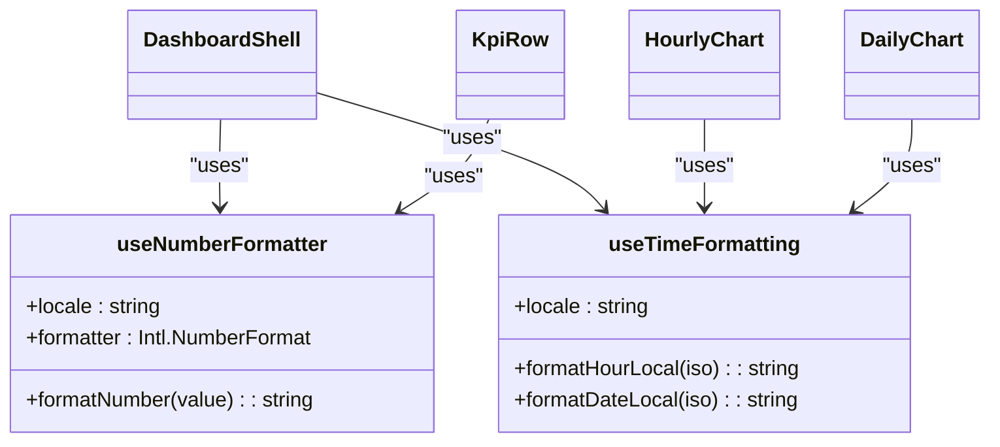

# State and Data Flow

<cite>
**Referenced Files in This Document**   
- [DashboardShell.tsx](file://app/components/DashboardShell.tsx)
- [route.ts](file://app/api/overview/route.ts)
- [useNumberFormatter.ts](file://app/hooks/useNumberFormatter.ts)
- [useTimeFormatting.ts](file://app/hooks/useTimeFormatting.ts)
- [DashboardClient.tsx](file://app/components/DashboardClient.tsx)
</cite>

## Table of Contents
1. [Introduction](#introduction)
2. [Core State Management](#core-state-management)
3. [Data Flow Lifecycle](#data-flow-lifecycle)
4. [Error Handling and Loading States](#error-handling-and-loading-states)
5. [Custom Formatting Hooks](#custom-formatting-hooks)
6. [Component Dependency Graph](#component-dependency-graph)
7. [Memory Efficiency and Performance](#memory-efficiency-and-performance)

## Introduction

This document details the client-side state management architecture of the dashboard application, with a focus on `DashboardShell.tsx` as the central orchestrator of application state. The system leverages React's built-in `useState` and `useEffect` hooks to manage filter parameters, API responses, and UI state in a unidirectional data flow pattern. User interactions trigger state updates that propagate through effect-driven API calls, resulting in re-rendered components with fresh data. The architecture emphasizes separation of concerns by abstracting formatting logic into reusable custom hooks and implementing robust error handling with visual feedback.

## Core State Management

The `DashboardShell` component serves as the single source of truth for the dashboard's client-side state, managing four key state variables using `useState`:

- **`days`**: Controls the time window filter (default: 1 day)
- **`chatId`**: Manages chat selection filter (null for all chats)
- **`data`**: Stores the complete API response payload
- **`error`**: Tracks loading errors for user feedback

These states are initialized with default values and updated exclusively through their corresponding setter functions (`setDays`, `setChatId`, etc.), ensuring predictable state transitions.

**Section sources**
- [DashboardShell.tsx](file://app/components/DashboardShell.tsx#L22-L30)

## Data Flow Lifecycle

The application implements a clean unidirectional data flow where user actions initiate a chain of events culminating in updated UI components. This lifecycle is orchestrated through two primary `useEffect` hooks that respond to changes in filter state.

### Filter-Driven API Requests

When users modify the time window or select a specific chat via the filter controls, the corresponding state variables (`days` or `chatId`) are updated. This triggers the primary `useEffect` hook, which constructs a parameterized URL and initiates a fetch request to `/api/overview`. The effect includes an `AbortController` to prevent race conditions when rapid filter changes occur.

**Diagram sources**
- [DashboardShell.tsx](file://app/components/DashboardShell.tsx#L32-L48)
- [route.ts](file://app/api/overview/route.ts#L50-L522)

### Default Chat Selection Logic

A secondary `useEffect` handles automatic chat selection when no chat is explicitly chosen. Upon receiving the initial API response containing available chats, the component automatically selects the most active chat (first in the list) to provide immediate value without requiring manual selection.

**Section sources**
- [DashboardShell.tsx](file://app/components/DashboardShell.tsx#L50-L60)

## Error Handling and Loading States

The component implements comprehensive UX considerations for various loading scenarios:

### Error State Management

When API requests fail (excluding aborts), the component sets the `error` state to display a user-friendly error message in Russian ("Ошибка загрузки"). The `AbortController` ensures that only genuine errors are reported, filtering out cancellations from rapid user interactions.

### Skeleton Loading UI

While awaiting API responses, the component renders a skeleton screen using animated pulse effects on placeholder elements. This provides immediate visual feedback that data is being loaded, improving perceived performance.

**Section sources**
- [DashboardShell.tsx](file://app/components/DashboardShell.tsx#L62-L75)

## Custom Formatting Hooks

The application abstracts formatting logic into two reusable custom hooks located in the `hooks` directory, promoting consistency across components while separating presentation concerns from business logic.

### Number Formatting Utility

The `useNumberFormatter` hook wraps the browser's `Intl.NumberFormat` API to provide locale-aware number formatting. It accepts an optional locale parameter (defaulting to 'ru-RU') and returns a `formatNumber` function that safely handles various input types including numbers, bigints, and nullish values.

**Section sources**
- [useNumberFormatter.ts](file://app/hooks/useNumberFormatter.ts#L2-L9)

### Time Formatting Utility

The `useTimeFormatting` hook provides two functions for consistent temporal presentation:
- `formatHourLocal`: Converts ISO timestamps to localized hour:minute format
- `formatDateLocal`: Formats dates according to the specified locale

These utilities ensure uniform time presentation across all dashboard components while encapsulating the complexity of date manipulation.

**Diagram sources**
- [useNumberFormatter.ts](file://app/hooks/useNumberFormatter.ts#L2-L9)
- [useTimeFormatting.ts](file://app/hooks/useTimeFormatting.ts#L2-L14)
- [DashboardShell.tsx](file://app/components/DashboardShell.tsx#L22-L99)

## Component Dependency Graph

The `DashboardShell` component serves as the parent container that composes multiple specialized subcomponents, each responsible for rendering a specific data visualization or metric. The shell passes down filtered and processed data as props to these atomic components.

```mermaid
graph TB
DashboardShell --> ChatSelect
DashboardShell --> WindowSelect
DashboardShell --> KpiRow
DashboardShell --> SummaryList
DashboardShell --> DailyChart
DashboardShell --> HourlyChart
DashboardShell --> UnansweredTable
DashboardShell --> TopErrorsTable
DashboardShell --> TopHelpersTable
DashboardShell --> TopThreadsTable
DashboardShell --> TopLinksTable
DashboardShell --> TopWordsTable
DashboardShell --> ArtifactsTable
DashboardShell --> HashtagsTable
DashboardShell --> MentionsTable
DashboardShell --> ForwardedFromTable
style DashboardShell fill:#f9f,stroke:#333
style ChatSelect fill:#bbf,stroke:#333
style WindowSelect fill:#bbf,stroke:#333
```

**Diagram sources**
- [DashboardShell.tsx](file://app/components/DashboardShell.tsx#L77-L99)

## Memory Efficiency and Performance

The architecture incorporates several performance optimizations:

### Controlled Re-renders

The `useEffect` dependencies array `[days, chatId]` ensures API calls only trigger when relevant filter parameters change, preventing unnecessary network requests during other state updates.

### Abort Signal Management

Each fetch operation includes an `AbortController` signal that automatically cancels pending requests when the component unmounts or when new requests supersede previous ones due to rapid filter changes. This prevents memory leaks and ensures only the most recent request's response is processed.

### Efficient Data Processing

The API route performs aggregation at the database level using PostgreSQL, minimizing data transfer and shifting computational load to the server. The client receives pre-aggregated metrics rather than raw message data, reducing parsing overhead and memory usage.

**Section sources**
- [DashboardShell.tsx](file://app/components/DashboardShell.tsx#L32-L48)
- [route.ts](file://app/api/overview/route.ts#L50-L522)