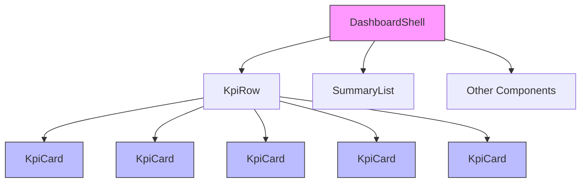
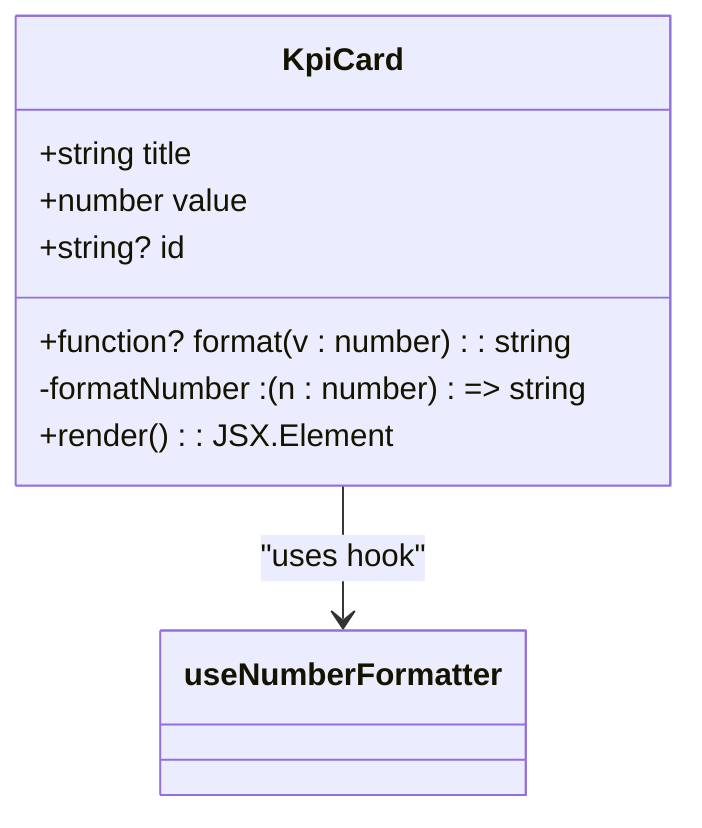
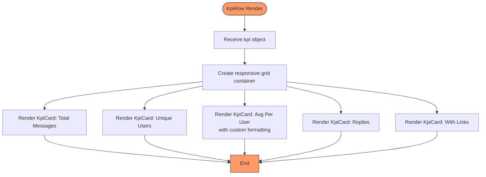
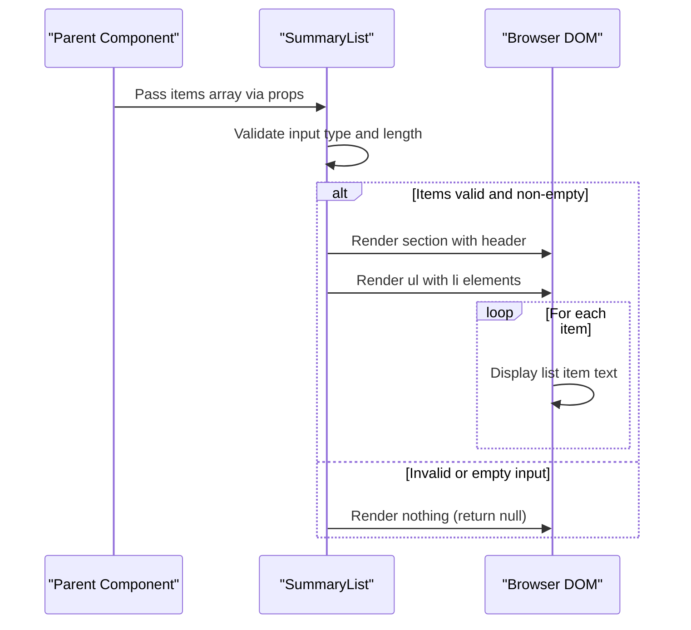

# UI Components

<cite>
**Referenced Files in This Document**  
- [KpiCard.tsx](file://app/components/atoms/KpiCard.tsx)
- [KpiRow.tsx](file://app/components/atoms/KpiRow.tsx)
- [SummaryList.tsx](file://app/components/atoms/SummaryList.tsx)
- [DashboardShell.tsx](file://app/components/DashboardShell.tsx)
- [useNumberFormatter.ts](file://app/hooks/useNumberFormatter.ts)
</cite>

## Table of Contents
1. [Introduction](#introduction)
2. [Core Atomic Components](#core-atomic-components)
3. [KpiCard Component](#kpiscard-component)
4. [KpiRow Component](#kpirow-component)
5. [SummaryList Component](#summarylist-component)
6. [Integration with DashboardShell](#integration-with-dashboardshell)
7. [Data Flow and API Integration](#data-flow-and-api-integration)
8. [Styling and Responsiveness](#styling-and-responsiveness)
9. [Accessibility Features](#accessibility-features)
10. [Extension and Customization Guidance](#extension-and-customization-guidance)

## Introduction

This document provides comprehensive documentation for the atomic UI components used in the tg-vibecoders-dashboard application. The focus is on three core reusable components: `KpiCard`, `KpiRow`, and `SummaryList`. These components form the foundation of the dashboard's data presentation layer, enabling consistent visualization of key performance indicators and LLM-generated insights. The documentation covers component architecture, props interface, integration patterns, styling approach, and extensibility guidelines.

## Core Atomic Components

The dashboard employs a component hierarchy where atomic components serve as building blocks for higher-level layouts. The `KpiCard` acts as the fundamental metric display unit, `KpiRow` composes multiple KPI cards into a responsive grid layout, and `SummaryList` renders bullet-point summaries from analytical insights. These components are designed to be stateless, receiving all data through props and maintaining separation of concerns within the React component tree.



**Diagram sources**  
- [DashboardShell.tsx](file://app/components/DashboardShell.tsx#L22-L99)
- [KpiRow.tsx](file://app/components/atoms/KpiRow.tsx#L14-L29)
- [KpiCard.tsx](file://app/components/atoms/KpiCard.tsx#L11-L20)

**Section sources**  
- [KpiCard.tsx](file://app/components/atoms/KpiCard.tsx#L1-L24)
- [KpiRow.tsx](file://app/components/atoms/KpiRow.tsx#L1-L33)
- [SummaryList.tsx](file://app/components/atoms/SummaryList.tsx#L1-L20)
- [DashboardShell.tsx](file://app/components/DashboardShell.tsx#L1-L103)

## KpiCard Component

The `KpiCard` component serves as a reusable container for displaying individual metrics with consistent visual styling. It accepts a title, numeric value, optional ID, and an optional formatting function. The component leverages the `useNumberFormatter` hook to provide locale-aware number formatting by default, while allowing custom formatting logic when needed.

### Props Interface
- `title`: String label displayed above the metric (e.g., "Total Messages")
- `value`: Numeric value to be displayed and formatted
- `id`: Optional HTML ID attribute for accessibility and testing
- `format`: Optional function to override default number formatting

The component implements conditional formatting logic, applying the custom formatter if provided, otherwise falling back to the internationalized number formatter configured for Russian locale by default.



**Diagram sources**  
- [KpiCard.tsx](file://app/components/atoms/KpiCard.tsx#L11-L20)
- [useNumberFormatter.ts](file://app/hooks/useNumberFormatter.ts#L4-L12)

**Section sources**  
- [KpiCard.tsx](file://app/components/atoms/KpiCard.tsx#L1-L24)

## KpiRow Component

The `KpiRow` component functions as a layout container that organizes multiple `KpiCard` instances into a responsive grid structure. It receives a structured `kpi` object containing specific metrics and maps these values to individual KPI cards with predefined titles and formatting rules.

### Data Structure Requirements
The component expects a `kpi` prop object with the following properties:
- `total_msgs`: Total message count
- `unique_users`: Count of unique participants
- `avg_per_user`: Average messages per user (formatted to 2 decimal places)
- `replies`: Number of reply messages
- `with_links`: Messages containing hyperlinks

The layout adapts responsively using Tailwind CSS grid classes, displaying two columns on small screens, three on medium screens, and five on large screens, ensuring optimal space utilization across device sizes.



**Diagram sources**  
- [KpiRow.tsx](file://app/components/atoms/KpiRow.tsx#L14-L29)

**Section sources**  
- [KpiRow.tsx](file://app/components/atoms/KpiRow.tsx#L1-L33)

## SummaryList Component

The `SummaryList` component is designed to render bullet-point summaries, typically generated by LLM-based analytics. It accepts an array of strings and displays them as a styled unordered list within a panel container. The component includes built-in validation to handle edge cases such as null or non-array inputs.

### Implementation Details
- Accepts `items` prop as an array of strings
- Returns null if items is not an array or is empty
- Uses semantic HTML `<section>` and `<ul>` elements for proper document structure
- Applies consistent typography and spacing using Tailwind utility classes
- Displays a fixed header "Short Summary" in Russian ("Короткое саммари")

The component serves as a dedicated presenter for textual insights, separating content rendering from data processing logic and maintaining consistency in how analytical summaries are displayed throughout the dashboard.



**Diagram sources**  
- [SummaryList.tsx](file://app/components/atoms/SummaryList.tsx#L4-L16)

**Section sources**  
- [SummaryList.tsx](file://app/components/atoms/SummaryList.tsx#L1-L20)

## Integration with DashboardShell

The atomic components are integrated within the `DashboardShell` component, which serves as the main container orchestrating data flow and layout composition. `DashboardShell` manages API communication, state, and prop distribution to child components including `KpiRow` and `SummaryList`.

### Component Composition Pattern
`DashboardShell` follows a container-component pattern where it:
- Fetches data from the `/api/overview` endpoint
- Manages loading and error states
- Extracts relevant data segments (`kpi`, `summaryBullets`)
- Passes extracted data to atomic components as props

This architectural approach ensures separation between data management and presentation concerns, making the atomic components highly reusable and testable in isolation.

```mermaid
graph TB
subgraph "DashboardShell"
State[State Management]
API[API Data Fetching]
Error[Error Handling]
Loader[Loading State]
end
subgraph "Atomic Components"
KR[KpiRow]
SL[SummaryList]
end
State --> KR
State --> SL
API --> State
Error --> UI
Loader --> UI
KR --> UI[Rendered Dashboard]
SL --> UI
style subgraph fill:#f0f0f0,stroke:#ccc
style UI fill:#cfc,stroke:#333
```

**Diagram sources**  
- [DashboardShell.tsx](file://app/components/DashboardShell.tsx#L22-L99)

**Section sources**  
- [DashboardShell.tsx](file://app/components/DashboardShell.tsx#L1-L103)

## Data Flow and API Integration

The components participate in a unidirectional data flow originating from API responses. The `DashboardShell` component retrieves aggregated metrics from the backend, which are then passed down through props to the atomic components for presentation.

### Usage Example
When the dashboard loads, the following sequence occurs:
1. `DashboardShell` fetches data from `/api/overview`
2. Response contains `kpi` object with metrics like `total_msgs`, `unique_users`, etc.
3. `DashboardShell` extracts the `kpi` object and passes it to `KpiRow`
4. `KpiRow` distributes individual values to respective `KpiCard` instances
5. Each `KpiCard` formats and displays its assigned metric

This pattern enables seamless integration with API responses without requiring atomic components to manage data fetching or transformation logic, promoting reusability across different data sources.

**Section sources**  
- [DashboardShell.tsx](file://app/components/DashboardShell.tsx#L45-L55)
- [KpiRow.tsx](file://app/components/atoms/KpiRow.tsx#L14-L29)

## Styling and Responsiveness

All components utilize Tailwind CSS for styling, employing utility-first classes to achieve consistent visual design and responsive behavior. The styling approach emphasizes maintainability and consistency across the application.

### Responsive Design Strategy
- `KpiRow` uses a progressive grid system: `grid-cols-2` (sm), `sm:grid-cols-3`, `lg:grid-cols-5`
- Container spacing is managed through `gap-3` for consistent padding between elements
- Typography scales use relative units (