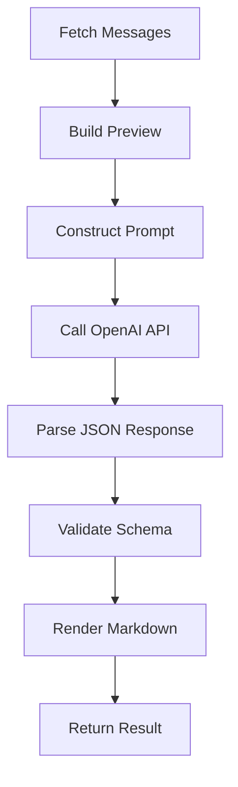
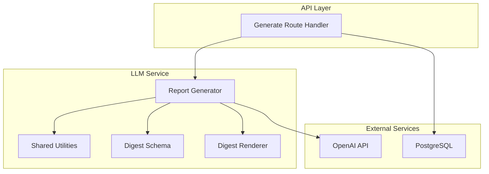
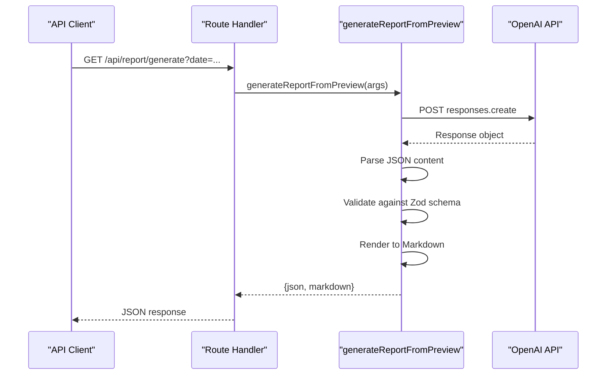
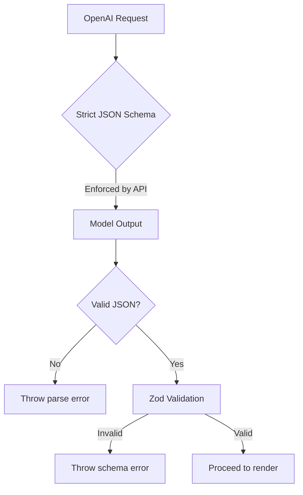
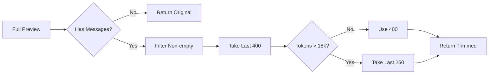
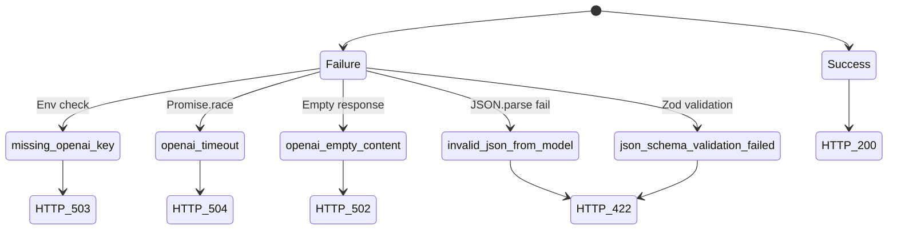
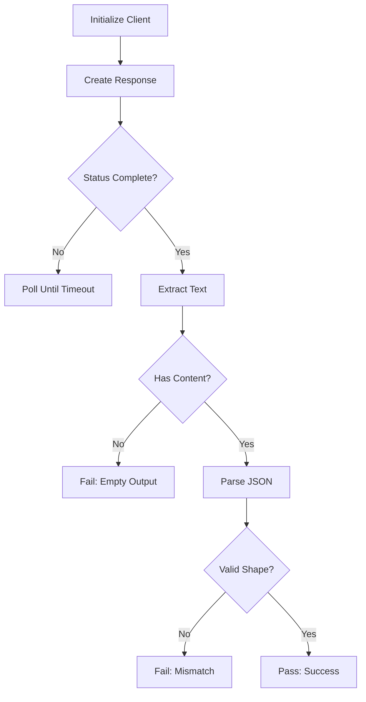

# LLM Integration

<cite>
**Referenced Files in This Document**   
- [app/api/report/generate/route.ts](file://app/api/report/generate/route.ts)
- [lib/llm/report.ts](file://lib/llm/report.ts)
- [lib/report/digest_schema.ts](file://lib/report/digest_schema.ts)
- [lib/llm/shared.ts](file://lib/llm/shared.ts)
- [lib/report/digest_render.ts](file://lib/report/digest_render.ts)
- [scripts/smoke-openai.mjs](file://scripts/smoke-openai.mjs)
- [scripts/smoke-digest.mjs](file://scripts/smoke-digest.mjs)
</cite>

## Table of Contents
1. [Introduction](#introduction)
2. [Process Flow Overview](#process-flow-overview)
3. [Core Components](#core-components)
4. [Architecture Overview](#architecture-overview)
5. [Detailed Component Analysis](#detailed-component-analysis)
6. [Prompt Engineering Techniques](#prompt-engineering-techniques)
7. [Error Handling and Recovery](#error-handling-and-recovery)
8. [Performance and Cost Considerations](#performance-and-cost-considerations)
9. [Testing Strategy](#testing-strategy)
10. [Conclusion](#conclusion)

## Introduction
The tg-vibecoders-dashboard application integrates with OpenAI's Responses API to generate structured daily digests from raw chat logs. This system transforms unstructured message data into actionable insights through a carefully orchestrated pipeline involving prompt engineering, schema enforcement, and robust error handling. The integration ensures deterministic JSON output for reliable downstream processing and UI rendering.

## Process Flow Overview
The LLM integration follows a multi-stage process:
1. Message fetching and preprocessing via `buildDailyPreview`
2. Prompt construction with context and instructions
3. API call to OpenAI Responses endpoint with strict JSON schema
4. Response validation using Zod schema
5. Markdown rendering for UI presentation



**Diagram sources**
- [app/api/report/generate/route.ts](file://app/api/report/generate/route.ts#L1-L52)
- [lib/llm/report.ts](file://lib/llm/report.ts#L16-L96)

## Core Components
The system consists of several key components working together to produce structured digests. These include the route handler, report generator, schema validator, and rendering engine.

**Section sources**
- [app/api/report/generate/route.ts](file://app/api/report/generate/route.ts#L1-L52)
- [lib/llm/report.ts](file://lib/llm/report.ts#L16-L96)

## Architecture Overview
The architecture separates concerns between data retrieval, LLM interaction, and output formatting. The system uses environment variables for configuration and implements timeout handling to prevent hanging requests.



**Diagram sources**
- [app/api/report/generate/route.ts](file://app/api/report/generate/route.ts#L1-L52)
- [lib/llm/report.ts](file://lib/llm/report.ts#L16-L96)
- [lib/report/digest_schema.ts](file://lib/report/digest_schema.ts#L11-L23)

## Detailed Component Analysis

### Report Generation Pipeline
The core functionality resides in the `generateReportFromPreview` function, which orchestrates the entire digest generation process.

#### Function Call Flow


**Diagram sources**
- [app/api/report/generate/route.ts](file://app/api/report/generate/route.ts#L1-L52)
- [lib/llm/report.ts](file://lib/llm/report.ts#L16-L96)

### Schema Validation System
The system employs dual-layer schema validation using both OpenAI's strict JSON schema and Zod runtime validation.

#### Schema Enforcement Flow


**Diagram sources**
- [lib/llm/report.ts](file://lib/llm/report.ts#L16-L96)
- [lib/report/digest_schema.ts](file://lib/report/digest_schema.ts#L11-L23)

## Prompt Engineering Techniques
The system uses carefully crafted prompts to guide model behavior and ensure consistent output format.

### System Prompts
The `SYSTEM_PROMPT` directive establishes clear expectations for the model:

- Requires exactly one JSON object output
- Specifies field-by-field requirements
- Enforces factual reporting from input messages only
- Prohibits markdown wrapping
- Defines participant formatting rules

```typescript
// Example prompt structure
const SYSTEM_PROMPT = `You are a daily digest editor... Return exactly one JSON object without markdown...`;
```

**Section sources**
- [lib/llm/shared.ts](file://lib/llm/shared.ts#L3-L21)

### Input Trimming Strategy
To manage token usage and focus on relevant content, the system implements intelligent preview trimming:

- Filters out empty messages
- Limits message history to last 400 (reduced to 250 if token threshold exceeded)
- Preserves essential metadata like time window



**Diagram sources**
- [lib/llm/shared.ts](file://lib/llm/shared.ts#L32-L45)

## Error Handling and Recovery
The system implements comprehensive error handling at multiple levels to ensure reliability.

### Error Types and Handling


**Diagram sources**
- [app/api/report/generate/route.ts](file://app/api/report/generate/route.ts#L1-L52)
- [lib/llm/report.ts](file://lib/llm/report.ts#L16-L96)

## Performance and Cost Considerations
The system balances performance, cost, and reliability through several mechanisms.

### Configuration Options
The following environment variables control performance characteristics:

- `OPENAI_API_KEY`: Authentication credential
- `OPENAI_MODEL`: Target model identifier
- `REPORT_MAX_OUTPUT_TOKENS`: Maximum response size
- `REPORT_TIMEOUT_MS`: Request deadline in milliseconds

These settings allow tuning based on cost/performance requirements and expected load patterns.

**Section sources**
- [lib/llm/report.ts](file://lib/llm/report.ts#L16-L96)

## Testing Strategy
The system includes dedicated smoke tests to verify critical functionality.

### Smoke Test Components
Two primary test scripts validate different aspects of the integration:

#### OpenAI Connectivity Test
Verifies basic API connectivity and JSON schema compliance with a minimal payload.



**Diagram sources**
- [scripts/smoke-openai.mjs](file://scripts/smoke-openai.mjs#L1-L103)

#### Digest Schema Compliance Test
Validates that the model can produce output matching the production digest schema.

**Section sources**
- [scripts/smoke-digest.mjs](file://scripts/smoke-digest.mjs#L1-L117)

## Conclusion
The LLM integration in tg-vibecoders-dashboard demonstrates a robust approach to generating structured insights from unstructured chat data. By combining strict schema enforcement, thoughtful prompt engineering, and comprehensive error handling, the system delivers reliable results suitable for production use. Developers can extend this foundation by customizing prompts, adding new features, or switching models while maintaining the integrity of the output format.