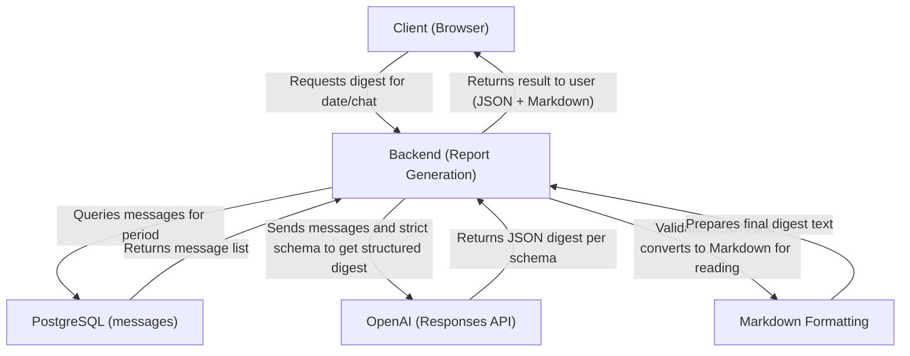

# Project Overview

<cite>
**Referenced Files in This Document**   
- [README.md](file://README.md)
- [package.json](file://package.json)
- [app/page.tsx](file://app/page.tsx)
- [app/week/page.tsx](file://app/week/page.tsx)
- [app/components/DashboardShell.tsx](file://app/components/DashboardShell.tsx)
- [app/api/overview/route.ts](file://app/api/overview/route.ts)
- [lib/report/slice.ts](file://lib/report/slice.ts)
- [lib/llm/report.ts](file://lib/llm/report.ts)
- [lib/report/digest_schema.ts](file://lib/report/digest_schema.ts)
- [lib/report/digest_render.ts](file://lib/report/digest_render.ts)
- [app/api/report/generate/route.ts](file://app/api/report/generate/route.ts)
</cite>

## Table of Contents
1. [Introduction](#introduction)
2. [Core Purpose and Value Proposition](#core-purpose-and-value-proposition)
3. [Ultra-MVP Design Philosophy](#ultra-mvp-design-philosophy)
4. [Key Architectural Decisions](#key-architectural-decisions)
5. [Data Flow and System Architecture](#data-flow-and-system-architecture)
6. [LLM-Powered Digest Generation](#llm-powered-digest-generation)
7. [User Interface and Visualizations](#user-interface-and-visualizations)
8. [Common Use Cases](#common-use-cases)
9. [Deployment and Operations](#deployment-and-operations)
10. [Scalability Trade-offs and Technical Constraints](#scalability-trade-offs-and-technical-constraints)

## Introduction
The tg-vibecoders-dashboard is a lightweight analytics solution designed to provide real-time insights into Telegram chat activity over 24-hour and 7-day windows. Built with simplicity and accessibility in mind, this dashboard enables both technical and non-technical users to monitor community engagement, identify trends, and extract actionable insights from chat data without complex setup or maintenance overhead.

**Section sources**
- [README.md](file://README.md#L1-L10)

## Core Purpose and Value Proposition
The primary purpose of the tg-vibecoders-dashboard is to transform raw Telegram message data into meaningful KPIs, visualizations, and AI-generated summaries. The system delivers three core value propositions: real-time key performance indicators (KPIs), trend analysis through time-series charts, and LLM-powered digest generation that surfaces important discussions, unanswered questions, and community insights. By focusing on immediate usability and minimal configuration, the dashboard allows teams to quickly understand their community's behavior and respond effectively.

**Section sources**
- [README.md](file://README.md#L1-L20)
- [app/page.tsx](file://app/page.tsx#L1-L24)

## Ultra-MVP Design Philosophy
The project follows an ultra-minimal viable product (MVP) philosophy characterized by minimal dependencies, no database migrations, and a single-server architecture built on Next.js. This approach eliminates common deployment complexities while ensuring fast iteration and low operational overhead. The system connects directly to an existing PostgreSQL database containing Telegram messages, avoiding the need for additional data pipelines or schema changes. With no authentication, logging, or containerization layers, the focus remains squarely on delivering actionable insights with maximum simplicity.

**Section sources**
- [README.md](file://README.md#L21-L30)
- [package.json](file://package.json#L1-L40)

## Key Architectural Decisions
Several critical architectural decisions shape the system's design: server-side data fetching via API routes, direct PostgreSQL integration for message storage, and use of the OpenAI Responses API for structured output. The backend leverages Node.js with the `pg` library to execute efficient SQL queries against the messages table, while the frontend consumes these APIs to render dynamic components. All time-based filtering occurs server-side based on the `sent_at` timestamp, ensuring accurate windowed analysis. The decision to use OpenAI's strict JSON schema mode guarantees predictable, parsable output from the LLM, enabling reliable downstream processing.

**Section sources**
- [app/api/overview/route.ts](file://app/api/overview/route.ts#L1-L300)
- [lib/report/slice.ts](file://lib/report/slice.ts#L100-L344)
- [lib/llm/report.ts](file://lib/llm/report.ts#L16-L96)

## Data Flow and System Architecture
The system operates through a clear data flow from user interface to database to AI processing and back. When a user requests a report, the Next.js API route queries PostgreSQL for messages within the specified time window, aggregates KPIs and top entities, then passes this structured preview to the OpenAI Responses API. After receiving and validating the structured digest, the system formats it for presentation alongside charts and tables.

**Diagram sources**
- [README.md](file://README.md#L70-L81)
- [app/api/report/generate/route.ts](file://app/api/report/generate/route.ts#L1-L52)
- [lib/llm/report.ts](file://lib/llm/report.ts#L16-L96)

**Section sources**
- [README.md](file://README.md#L70-L81)
- [app/api/report/generate/route.ts](file://app/api/report/generate/route.ts#L1-L52)

## LLM-Powered Digest Generation
The dashboard leverages the OpenAI Responses API to generate structured, human-readable digests from chat data. Using a predefined JSON schema (`DailyDigestJsonSchemaForLLM`), the system enforces strict output formatting that includes discussion summaries, resources shared, unanswered questions, participant statistics, and key insights. This structured approach ensures consistency and reliability in AI output, while client-side rendering transforms the JSON into clean Markdown for easy consumption. The validation pipeline checks both schema compliance and content quality before presenting results to users.

**Section sources**
- [lib/report/digest_schema.ts](file://lib/report/digest_schema.ts#L1-L67)
- [lib/report/digest_render.ts](file://lib/report/digest_render.ts#L1-L36)
- [lib/llm/report.ts](file://lib/llm/report.ts#L16-L96)

## User Interface and Visualizations
The user interface presents insights through a combination of KPI cards, interactive charts using Chart.js, and sortable data tables. The main dashboard displays hourly or daily activity patterns, top contributors, most active threads, frequently shared links, and unanswered messages. Users can filter data by chat and time window using intuitive controls. The layout adapts responsively across devices, organizing related metrics into logical groupings that facilitate quick scanning and interpretation. Real-time loading states and error handling ensure a smooth user experience even during data retrieval.

**Section sources**
- [app/components/DashboardShell.tsx](file://app/components/DashboardShell.tsx#L1-L103)
- [app/components/charts/HourlyChart.tsx](file://app/components/charts/HourlyChart.tsx#L1-L64)
- [app/components/charts/DailyChart.tsx](file://app/components/charts/DailyChart.tsx#L1-L42)

## Common Use Cases
This dashboard serves several practical use cases including community moderation, engagement tracking, and content discovery. Moderators can identify trending topics, detect unanswered member questions, and spot potential issues through error token detection. Team leads can track participation levels, recognize helpful contributors, and assess overall channel health. Content creators can discover popular discussion themes, analyze posting patterns, and surface valuable resources shared within the community. The combination of quantitative metrics and qualitative AI summaries provides a comprehensive view of chat dynamics.

**Section sources**
- [README.md](file://README.md#L1-L81)
- [app/components/tables/UnansweredTable.tsx](file://app/components/tables/UnansweredTable.tsx#L1-L10)

## Deployment and Operations
The application is designed for straightforward deployment on platforms like Railway, Vercel, or Render with minimal configuration. It requires only Node.js 18+, a PostgreSQL connection string (`DATABASE_URL`), and optionally an OpenAI API key for digest generation. The single-process architecture runs efficiently without Docker or complex orchestration. Environment variables control optional settings such as SSL configuration (`PGSSL=disable`) and default chat selection. This simplicity enables rapid deployment and reduces ongoing operational burden, making it ideal for small teams or individual contributors managing community channels.

**Section sources**
- [README.md](file://README.md#L50-L60)
- [package.json](file://package.json#L1-L40)

## Scalability Trade-offs and Technical Constraints
While the ultra-MVP design prioritizes simplicity, it introduces certain scalability limitations. The lack of caching means repeated queries for the same time window will re-execute full database scans. The single-server model does not support horizontal scaling, and long-running LLM requests could block other operations under high load. There are no background jobs or queueing mechanisms, so all processing occurs synchronously during HTTP requests. However, these constraints are intentional trade-offs that keep the system maintainable and understandable, particularly for beginners. For larger datasets, query optimization and connection pooling help mitigate performance concerns within reasonable bounds.

**Section sources**
- [lib/report/slice.ts](file://lib/report/slice.ts#L100-L344)
- [app/api/overview/route.ts](file://app/api/overview/route.ts#L1-L300)
- [README.md](file://README.md#L1-L81)