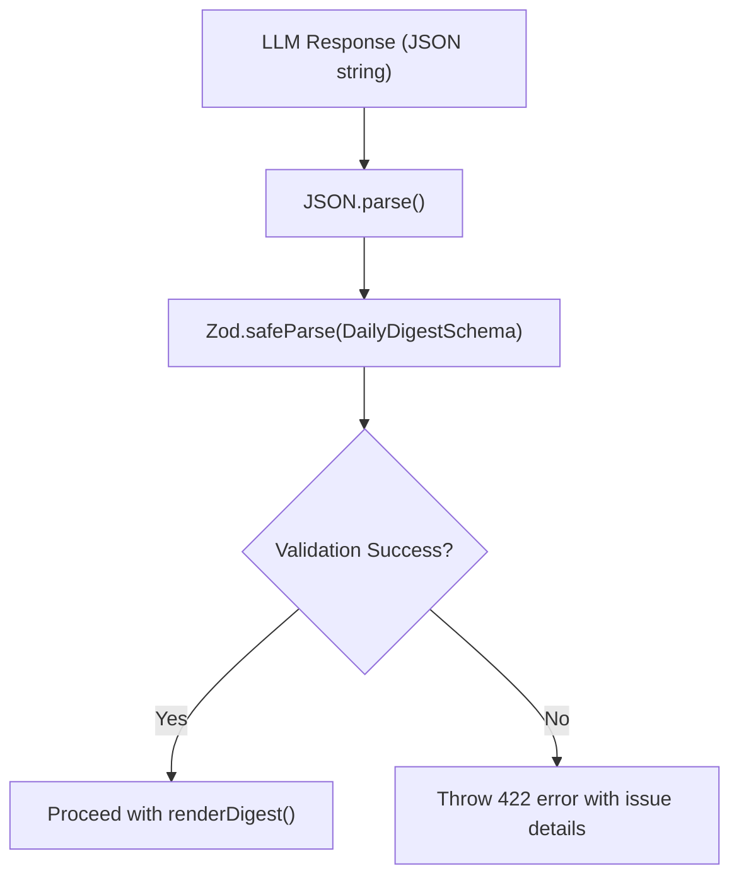
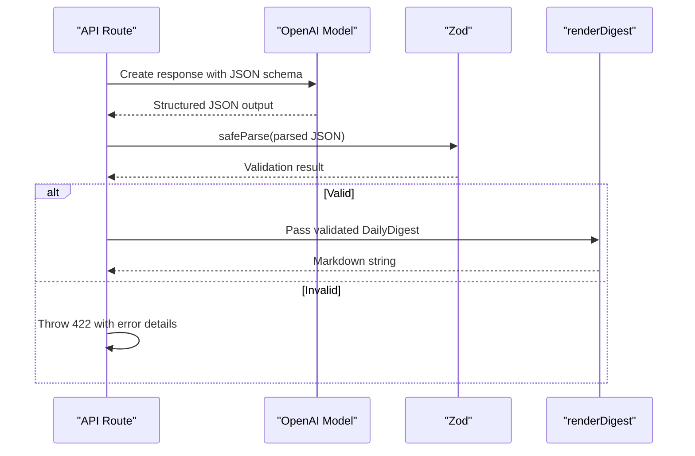

# Technology Stack

<cite>
**Referenced Files in This Document**   
- [package.json](file://package.json)
- [tsconfig.json](file://tsconfig.json)
- [next.config.js](file://next.config.js)
- [digest_schema.ts](file://lib/report/digest_schema.ts)
- [report.ts](file://lib/llm/report.ts)
- [route.ts](file://app/api/report/generate/route.ts)
- [slice.ts](file://lib/report/slice.ts)
</cite>

## Table of Contents
1. [Core Frameworks and Libraries](#core-frameworks-and-libraries)
2. [Runtime and Development Requirements](#runtime-and-development-requirements)
3. [Data Validation with Zod](#data-validation-with-zod)
4. [LLM Integration via OpenAI Responses API](#llm-integration-via-openai-responses-api)
5. [Database Connectivity with pg](#database-connectivity-with-pg)
6. [Frontend Styling and Tooling](#frontend-styling-and-tooling)
7. [Development Experience and Production Optimization](#development-experience-and-production-optimization)

## Core Frameworks and Libraries

The tg-vibecoders-dashboard leverages a modern full-stack JavaScript ecosystem centered around Next.js and React, enabling high-performance server-rendered applications with rich client interactivity.

Next.js 15.4.6 serves as the foundational framework, utilizing its App Router architecture to define API routes under `/app/api` and support React Server Components for efficient data fetching and rendering. The application benefits from hybrid static and dynamic rendering capabilities, allowing fast initial loads while supporting real-time report generation. React 19.1.1 powers the component-based UI, providing enhanced reactivity and developer ergonomics through concurrent features and improved hooks semantics.

Chart.js 4.5.0 is employed for time-series visualizations such as message activity over hourly intervals, offering responsive, interactive charts with minimal configuration overhead. Its integration within React components enables seamless updates when filtering or changing date ranges in the dashboard interface.

**Section sources**
- [package.json](file://package.json#L1-L42)
- [app/api/report/generate/route.ts](file://app/api/report/generate/route.ts#L1-L52)

## Runtime and Development Requirements

The project enforces Node.js version 18 or higher through the `engines` field in package.json, ensuring compatibility with modern ECMAScript features and optimal performance of underlying dependencies like the OpenAI SDK and PostgreSQL driver.

TypeScript 5.9.2 provides comprehensive type safety across the codebase, enabling robust refactoring, intelligent autocompletion, and compile-time validation of complex data structures such as LLM-generated reports. The tsconfig.json configuration extends base settings with Next.js plugin support, strict null checks disabled for pragmatic development speed, and incremental compilation for faster builds.

PostCSS processes CSS directives and integrates Tailwind's utility classes into optimized stylesheets during build time, while dotenv manages environment variables for secure credential handling—particularly critical for API keys used in external services like OpenAI and database connections.

**Section sources**
- [package.json](file://package.json#L1-L42)
- [tsconfig.json](file://tsconfig.json#L1-L36)
- [postcss.config.mjs](file://postcss.config.mjs#L1-L3)

## Data Validation with Zod

Zod 3.23.8 plays a pivotal role in ensuring runtime type safety for AI-generated JSON outputs. Given the inherent unpredictability of LLM responses, schema validation is essential to maintain data integrity before rendering or further processing.

The `DailyDigestSchema` defined in `digest_schema.ts` specifies a structured format for daily digest reports, including arrays of discussions, resources, unanswered questions, and statistical metrics. It uses `.passthrough()` to allow additional numeric fields in the `stats` object beyond the required `messages_count` and `participants_count`, accommodating evolving data sources without breaking existing parsers.

This validation pipeline ensures that only correctly structured data proceeds to downstream functions like `renderDigest`, preventing runtime errors due to malformed payloads.

**Diagram sources**
- [digest_schema.ts](file://lib/report/digest_schema.ts#L1-L67)

**Section sources**
- [digest_schema.ts](file://lib/report/digest_schema.ts#L1-L67)
- [report.ts](file://lib/llm/report.ts#L83-L83)

## LLM Integration via OpenAI Responses API

OpenAI 5.12.2 facilitates interactions with large language models using the Responses API, which supports structured output via JSON Schema constraints. The `DailyDigestJsonSchemaForLLM` object defines a strict schema that enforces field presence and types, even marking optional fields like `insights` as required in the `required` array—a requirement of OpenAI’s strict mode.

In `generateReportFromPreview`, the application configures the OpenAI client with this schema to guarantee that generated content adheres to expected formats. After receiving a response, it first parses the JSON and then validates it against the Zod schema, creating a dual-layer defense against invalid data.

This approach combines compile-time TypeScript types (`DailyDigest = z.infer<typeof DailyDigestSchema>`) with runtime validation, delivering end-to-end type confidence from model output to UI rendering.

**Diagram sources**
- [digest_schema.ts](file://lib/report/digest_schema.ts#L29-L63)
- [report.ts](file://lib/llm/report.ts#L16-L96)

**Section sources**
- [digest_schema.ts](file://lib/report/digest_schema.ts#L29-L63)
- [report.ts](file://lib/llm/report.ts#L16-L96)

## Database Connectivity with pg

The `pg` library (version 8.16.3) establishes reliable connectivity to PostgreSQL, managing a connection pool configured via environment variables. The `getPool()` function initializes a shared Pool instance with SSL options controlled by `PGSSL`, defaulting to secure connections unless explicitly disabled.

Queries are executed within the context of a managed client obtained from the pool, ensuring proper resource cleanup via try-finally blocks. Parameterized queries prevent SQL injection, and transactions are avoided in favor of atomic SELECT operations given the read-only nature of report generation.

Key queries include:
- Hourly message counts using `generate_series` for complete time coverage
- Top thread identification via CTE-based reply counting
- Unanswered question detection using `NOT EXISTS` subqueries
- KPI aggregation in single-pass queries for efficiency

**Section sources**
- [slice.ts](file://lib/report/slice.ts#L30-L39)
- [slice.ts](file://lib/report/slice.ts#L100-L344)

## Frontend Styling and Tooling

Tailwind CSS enables utility-first styling, promoting rapid UI development through atomic classes directly in JSX. This eliminates context switching between files and encourages consistency via constrained design tokens.

Component structure follows a modular pattern:
- **Atoms**: Reusable primitives like `KpiCard` and `SummaryList`
- **Charts**: Time-series visualizations using Chart.js wrappers
- **Tables**: Data displays for top links, errors, threads, etc.
- **Filters**: Interactive controls for chat selection and time windows

All styles are scoped globally via `globals.css`, processed through PostCSS to resolve Tailwind directives into final CSS rules. This setup supports responsive layouts and dark mode if extended, though current implementation focuses on functional clarity over aesthetic complexity.

**Section sources**
- [components/atoms/KpiCard.tsx](file://app/components/atoms/KpiCard.tsx#L1-L10)
- [components/charts/DailyChart.tsx](file://app/components/charts/DailyChart.tsx#L1-L10)

## Development Experience and Production Optimization

Development workflows are streamlined through `next dev`, which provides hot reloading and instant feedback on code changes. To mitigate instability during heavy refactoring, the configuration disables fast refresh in certain modes via `NEXT_DISABLE_FAST_REFRESH`.

Production optimization occurs through `next build`, which pre-renders static content and optimizes assets. Dynamic API routes like `/api/report/generate` execute on-demand in Node.js runtime, leveraging Vercel’s serverless infrastructure for scalability.

Error handling is comprehensive:
- Missing environment variables fail early with descriptive messages
- Database and OpenAI timeouts are caught and propagated with request IDs
- Schema validation failures return detailed path-message pairs for debugging
- All errors log context for observability without exposing sensitive data

This stack balances developer productivity with production reliability, making it well-suited for AI-powered analytics dashboards requiring both flexibility and robustness.

**Section sources**
- [next.config.js](file://next.config.js#L1-L14)
- [route.ts](file://app/api/report/generate/route.ts#L30-L51)