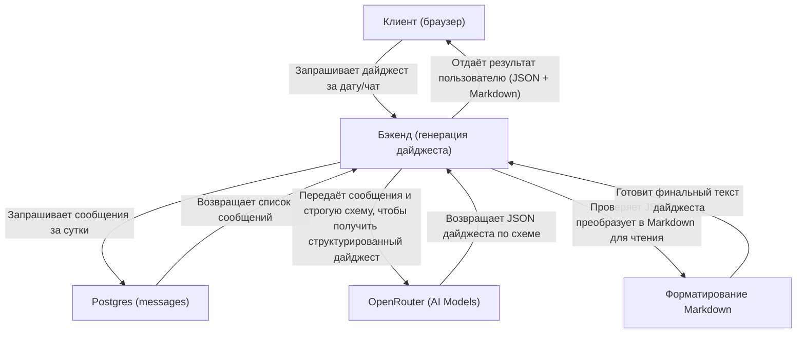

<!-- hq-readme-ru: 2026-05-09 -->
# tg-vibecoders-dashboard

Коротко: Telegram-проект или бот по теме «tg vibecoders dashboard».

## Что здесь

- Назначение: Telegram-проект или бот по теме «tg vibecoders dashboard».
- Основной стек: TypeScript.
- Видимость: публичный репозиторий.
- Статус: активный репозиторий; актуальность проверять по issues и последним коммитам.

## Где смотреть работу

- Задачи и текущие решения: GitHub Issues этого репозитория.
- Код и материалы: файлы в корне и профильные папки проекта.
- Связь с HQ: если проект влияет на продукт, контент или воронку, сверяйте канон в `0_hq` и репозитории-владельце.

## Для агентов

- Сначала прочитайте этот README и открытые issues.
- Не переносите сюда канон соседних проектов без ссылки на источник.
- Перед правками проверьте существующие scripts, package.json/pyproject и локальные инструкции.

---

## Исходный README

# Telegram Dashboard — Analytics & Insights

Next.js-based dashboard для анализа Telegram чатов с AI-powered инсайтами. Подключается к существующей Railway Postgres без миграций.

## Запуск локально

1) Node 18+
2) Скопируй `env.example` → `.env` и заполни переменные окружения
3) Установи зависимости и стартуй:

```bash
npm install
npm run dev
```

Открой:
- Dashboard: http://localhost:3000/
- 7 дней: http://localhost:3000/week
- Отчеты: http://localhost:3000/report/dev

## Переменные окружения

- `DATABASE_URL` — строка подключения Railway (postgresql://...)
- `PORT` — порт (по умолчанию 3000)
- `PGSSL` — если SSL не нужен, установи `PGSSL=disable`
- `OPENROUTER_API_KEY` — API ключ для OpenRouter (обязательно для генерации отчетов)
- `OPENROUTER_MODEL` — модель AI для использования (например: `anthropic/claude-3.5-sonnet`)
- `OPENROUTER_BASE_URL` — базовый URL для OpenRouter API (опционально, по умолчанию: `https://openrouter.ai/api/v1`)
- `REPORT_TIMEOUT_MS` — таймаут для запросов к AI в миллисекундах (по умолчанию: 120000)
- `REPORT_MAX_OUTPUT_TOKENS` — максимальное количество токенов в ответе AI (опционально)
- `DEFAULT_CHAT_ID` — ID чата по умолчанию, если не указан в параметрах (опционально)

Пример см. в `env.example`.

## API Endpoints

### Analytics
- `GET /api/overview` — последние 24 часа
- `GET /api/overview?days=7` — окно в днях (1..30)
- `GET /api/overview?chat_id=CHAT_ID` — фильтр по чату

### AI Reports
- `GET /api/report/generate?date=YYYY-MM-DD` — генерация AI отчета за день
- `GET /api/report/insights?date=YYYY-MM-DD` — генерация AI инсайтов за день
- `GET /api/report/preview?date=YYYY-MM-DD` — предпросмотр данных для отчета

Overview API возвращает:
- `kpi` — базовые метрики (сообщения, пользователи, ответы, ссылки)
- `hourly/daily` — временные тренды
- `topUsers`, `topLinks`, `topWords`, `topThreads` — рейтинги
- `unanswered` — вопросы без ответов (>12ч)
- `topHelpers` — лидерборд помощников
- `topErrors` — частые ошибки
- `artifacts` — код и проекты (GitHub, Vercel, etc.)
- `topHashtags`, `topMentions` — теги и упоминания
- `forwardedFrom` — источники пересылок

Все запросы считают окно времени на сервере и фильтруют по `sent_at`.

## Tech Stack

- **Frontend**: Next.js 15, React 19, Tailwind CSS, Chart.js
- **Backend**: Next.js App Router, PostgreSQL (pg)
- **AI интеграция**: OpenRouter API для множественных LLM провайдеров
- **LLM поддержка**: Anthropic Claude, OpenAI GPT, Google Gemini, и другие
- **Типизация**: TypeScript, Zod для валидации схем
- MVP подход: без Docker/миграций/аутентификации

## Deployment

### Build & Start
```bash
npm run build
npm start
```

### Environment Variables
- `DATABASE_URL` — PostgreSQL connection string
- `PGSSL` — set to `disable` if SSL not needed
- **OpenRouter Configuration** (required for AI features):
  - `OPENROUTER_API_KEY` — get from https://openrouter.ai
  - `OPENROUTER_MODEL` — e.g., `anthropic/claude-3.5-sonnet`
  - `OPENROUTER_BASE_URL` — defaults to OpenRouter API
- **Optional Settings**:
  - `REPORT_TIMEOUT_MS` — AI request timeout (default: 120000)
  - `REPORT_MAX_OUTPUT_TOKENS` — max AI response tokens
  - `DEFAULT_CHAT_ID` — default chat filter

### Platforms
Works on Vercel, Railway, Render, or any Node.js 18+ hosting.

## Примечания

- Имя пользователя выводится как `Имя Фамилия (@username)`, если доступно.
- Из БД используются поля таблиц:
  - `messages(message_id, chat_id, user_id, text, sent_at, raw_message)`
  - `users(id, first_name, last_name, username)`
- Replies считаются по ключу `raw_message -> reply_to_message`.

## Диаграмма потока данных (простой дайджест)



## Features

### 📊 Analytics Dashboard
- **Real-time metrics**: Сообщения, пользователи, активность
- **Temporal analysis**: Почасовые и дневные тренды
- **User insights**: Топ-пользователи, хелперы, активность
- **Content analysis**: Популярные слова, ссылки, хештеги
- **Thread tracking**: Активные обсуждения и вопросы без ответов
- **Error monitoring**: Автоматическое выявление ошибок
- **Artifacts**: Отслеживание GitHub, Vercel, и других проектов

### 🤖 AI-Powered Reports
- **Daily insights**: Умный анализ активности за день
- **Structured output**: JSON schema validation для надежности
- **Multiple AI models**: Через OpenRouter (Claude, GPT-4, Gemini)
- **Flexible prompting**: Настраиваемые промпты для разных типов отчетов

### 🎯 Chat Filtering
- Фильтрация по конкретным чатам
- Агрегация данных по всем чатам
- Автоматический выбор активного чата

## Testing

```bash
# Quick API tests
npm run smoke:openrouter  # Test OpenRouter integration
npm run smoke:digest     # Test report generation
```

